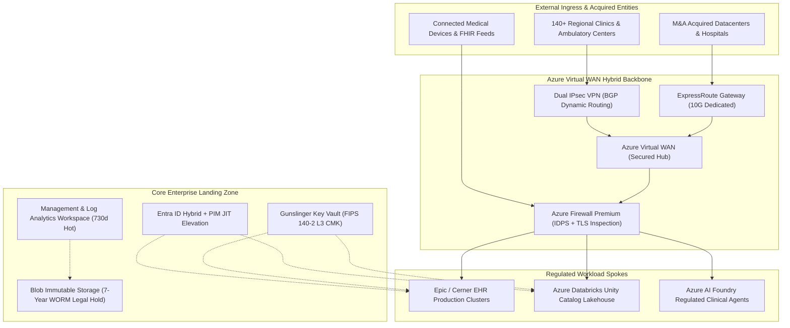
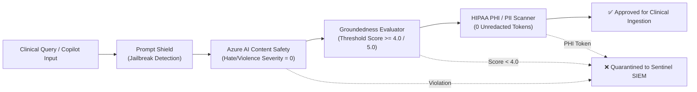

# Mosaic Healthcare Enterprise Cloud Architecture & M&A Governance Portal

[](https://github.com/FreeFades2Black/mosaic-health-cloud-architecture/actions/workflows/deploy.yml)
[](https://github.com/FreeFades2Black/mosaic-health-cloud-architecture/actions/workflows/ai-foundry-regulation.yml)
[](https://github.com/FreeFades2Black/mosaic-health-cloud-architecture/actions/workflows/test-azure-connection.yml)
[](https://github.com/FreeFades2Black/mosaic-health-cloud-architecture/actions/workflows/deploy-azure-resources.yml)
[](https://freefades2black.github.io/mosaic-health-cloud-architecture/)
[](https://freefades2black.github.io/mosaic-health-cloud-architecture/compliance-hitrust/)
[](https://freefades2black.github.io/mosaic-health-cloud-architecture/landing-zone/)
[](Dockerfile)
[](LICENSE)

---

## 🌐 Live GitHub Pages Portal Location

> ### 🔗 **Primary Live Portal:** [https://freefades2black.github.io/mosaic-health-cloud-architecture/](https://freefades2black.github.io/mosaic-health-cloud-architecture/)
> Hosted directly on **GitHub Pages** via automated GitHub Actions continuous delivery from the `gh-pages` branch.

### 📍 Direct Live Route Index

| Portal Section | Live GitHub Pages Location | Focus Area |
| :--- | :--- | :--- |
| **🏠 Portal Home** | [Portal Index](https://freefades2black.github.io/mosaic-health-cloud-architecture/) | Executive summary, four pillars, system context topology, and governance overview. |
| **☁️ Azure Landing Zone** | [Landing Zone Overview](https://freefades2black.github.io/mosaic-health-cloud-architecture/landing-zone/) | Microsoft Cloud Adoption Framework (CAF) healthcare foundation. |
| **🏢 Management Groups** | [Management Group Hierarchy](https://freefades2black.github.io/mosaic-health-cloud-architecture/landing-zone/management-groups/) | Hierarchical subscription placement, root Azure Policy sets, and Subscription Vending Machine (SVM). |
| **🌐 Hybrid Networking** | [vWAN & Hybrid Backbone](https://freefades2black.github.io/mosaic-health-cloud-architecture/landing-zone/hybrid-networking/) | Azure Virtual WAN Secured Hub, 10G ExpressRoute, Dual IPsec VPN, and Azure Firewall Premium IDPS. |
| **🔐 Identity & Access** | [Entra ID, PIM & Zero-Trust](https://freefades2black.github.io/mosaic-health-cloud-architecture/landing-zone/identity-access/) | Hybrid identity synchronization, Phishing-Resistant FIDO2 MFA, and Just-in-Time (JIT) PIM elevation. |
| **📋 M&A Due Diligence** | [Due Diligence Checklist](https://freefades2black.github.io/mosaic-health-cloud-architecture/ma-playbook/due-diligence-checklist/) | 8-pillar technical discovery audit (Active Directory, VMware, SAN, CIDR overlap, cyber risk). |
| **⚡ Wave Migration** | [Wave Sequencer & Rollback](https://freefades2black.github.io/mosaic-health-cloud-architecture/ma-playbook/wave-migration-sequencer/) | 5-R workload rationalization, 4-phase cutover schedule, Go/No-Go gates, and automated rollback triggers. |
| **🛡️ HITRUST Control Matrix** | [Control Mapping Matrix](https://freefades2black.github.io/mosaic-health-cloud-architecture/compliance-hitrust/control-mapping-matrix/) | Searchable ledger mapping HIPAA § 164.312 and HITRUST CSF v11 domains to technical Azure controls. |
| **📊 Centralized Logging** | [Audit Evidence Pipeline](https://freefades2black.github.io/mosaic-health-cloud-architecture/compliance-hitrust/audit-evidence-logging/) | 730-day hot analytics in Log Analytics Workspace + 7-year immutable WORM archive in Azure Blob Storage. |
| **🤖 AI Foundry Governance** | [AI Foundry & Model Regulation](https://freefades2black.github.io/mosaic-health-cloud-architecture/compliance-hitrust/ai-foundry-governance/) | Automated evaluation gates, Content Safety thresholds, groundedness scoring, and HIPAA PHI redaction. |
| **🗺️ Multi-Cloud Matrix** | [AWS vs GCP vs Azure](https://freefades2black.github.io/mosaic-health-cloud-architecture/multicloud-matrix/aws-gcp-azure-mapping/) | Rosetta Stone translation table across IAM, Transit Networking, Object Storage, and SIEM. |
| **⚖️ Workload Rationalization**| [Migration Decision Framework](https://freefades2black.github.io/mosaic-health-cloud-architecture/multicloud-matrix/migration-rationalization/) | Economic and clinical latency decision tree for consolidating acquired cloud assets. |
| **📜 ARB Decision Registry** | [ADR Index](https://freefades2black.github.io/mosaic-health-cloud-architecture/arb-adrs/) | Architecture Review Board governance charter and formal decision lifecycle. |
| **📝 ADR-001 (vWAN)** | [ADR-001: vWAN Ingress](https://freefades2black.github.io/mosaic-health-cloud-architecture/arb-adrs/adr-001-vwan-hub-spoke/) | Adoption of Azure Virtual WAN Secured Hub for 140+ clinic network ingress. |
| **🔑 ADR-002 (CMK)** | [ADR-002: Key Vault CMK](https://freefades2black.github.io/mosaic-health-cloud-architecture/arb-adrs/adr-002-key-vault-cmk/) | Customer-Managed Keys via FIPS 140-2 Level 3 HSM for all clinical data stores. |
| **🤝 ADR-003 (M&A Tenant)** | [ADR-003: Tenant Consolidation](https://freefades2black.github.io/mosaic-health-cloud-architecture/arb-adrs/adr-003-tenant-consolidation/) | 3-phase cross-tenant coexistence model for zero clinical disruption during mergers. |
| **📊 Build Monitor Dashboard** | [Azure Build & Governance Monitor](https://freefades2black.github.io/mosaic-health-cloud-architecture/dashboards/azure-build-monitor/) | Real-time telemetry, Entra ID status, OIDC Workload Identity, and test suite metrics. |
| **🏗️ Terraform Module** | [Gunslinger Secure Vault](https://freefades2black.github.io/mosaic-health-cloud-architecture/mosaic_key_vault_module/) | Annotated production Terraform module with private endpoints and auto-rotation policies. |

---

## 📂 Repository File & Directory Structure

```
mosaic-health-cloud-architecture/
├── .github/
│   └── workflows/
│       ├── deploy.yml                        # GitHub Actions CI/CD (Test & Deploy to GitHub Pages)
│       ├── ai-foundry-regulation.yml         # Azure AI Foundry Model & Agent Regulation Gate
│       ├── test-azure-connection.yml         # Zero-Secret GitHub Actions OIDC Authentication Test
│       └── deploy-azure-resources.yml        # Resource Group & Landing Zone Automated Deployment
├── docs/
│   ├── index.md                              # Portal Home & Executive Architecture Overview
│   ├── mosaic_key_vault_module.md            # Gunslinger Key Vault Blueprint Documentation
│   ├── javascripts/
│   │   └── mermaid-instant.js                # Instant Mermaid diagram renderer (document$ lifecycle hook for SPA)
│   ├── stylesheets/
│   │   └── extra.css                         # Custom Enterprise Portal Styles (Teal theme, badges, tables)
│   ├── landing-zone/
│   │   ├── index.md                          # Azure Landing Zone & Hybrid Backbone Overview
│   │   ├── management-groups.md              # Management Group Hierarchy (Root -> Platform -> Workloads)
│   │   ├── hybrid-networking.md              # Hub-and-Spoke, vWAN, ExpressRoute, Dual IPsec VPN, Azure FW
│   │   └── identity-access.md                # Entra ID Hybrid Sync, Conditional Access, PIM Workflows
│   ├── ma-playbook/
│   │   ├── index.md                          # M&A Due Diligence & Workload Migration Engine Overview
│   │   ├── due-diligence-checklist.md        # Discovery Checklist (VMware, SAN, AD levels, Public cloud)
│   │   └── wave-migration-sequencer.md       # 5-R Rationalization, Phase 0/1/2 Cutover & Rollback triggers
│   ├── compliance-hitrust/
│   │   ├── index.md                          # HIPAA & HITRUST CSF Framework Overview
│   │   ├── control-mapping-matrix.md         # Searchable Table: HITRUST controls to Azure technical controls
│   │   ├── audit-evidence-logging.md         # Diagnostic log forwarding to Log Analytics & Sentinel
│   │   └── ai-foundry-governance.md          # AI Foundry Agent Evaluation, Prompty & Content Safety
│   ├── dashboards/
│   │   └── azure-build-monitor.md            # Live Enterprise Build & Governance Monitor
│   ├── multicloud-matrix/
│   │   ├── index.md                          # Multi-Cloud Rosetta Stone Overview
│   │   ├── aws-gcp-azure-mapping.md          # AWS/GCP to Azure Service Translation Table
│   │   └── migration-rationalization.md      # Retain vs Migrate decision framework
│   └── arb-adrs/
│       ├── index.md                          # Architecture Decision Records Index & Governance Charter
│       ├── adr-001-vwan-hub-spoke.md         # ADR-001: Adoption of vWAN Hub-Spoke for Clinic Ingress
│       ├── adr-002-key-vault-cmk.md          # ADR-002: Key Vault CMK for all PHI Data Stores
│       └── adr-003-tenant-consolidation.md   # ADR-003: Tenant Consolidation Strategy (Coexistence vs Cutover)
├── src/
│   ├── ai_foundry/
│   │   └── agent_evaluator.py                # Azure AI Foundry Content Safety, Groundedness & PHI Scanner
│   └── governance/
│       └── entra_security_auditor.py         # Microsoft Entra ID Zero-Trust Posture Auditor
├── terraform/
│   └── gunslinger-secure-vault/
│       ├── main.tf                           # HITRUST-compliant Key Vault with private endpoints (Annotated)
│       ├── variables.tf                      # Annotated variables with regex validation rules
│       ├── outputs.tf                        # Resource ID, Vault URI, CMK Key ID outputs (Annotated)
│       └── terraform.tfvars.example          # Sanitized enterprise example parameters
├── tests/
│   ├── test_portal_build.py                  # Validates all pages, ADRs, and Terraform structure
│   ├── test_foundry_agent_regulation.py      # Validates AI Foundry harm scores, groundedness, and PHI
│   └── test_entra_auditor.py                 # Validates Entra ID Zero-Trust posture rules
├── azure_portal_build_dashboard.json         # Azure Portal ARM Dashboard Template (Importable)
├── Dockerfile                                # Multi-stage production container (Python builder + Nginx runner)
├── docker-compose.yml                        # Local testing service mapping port 8000
├── .dockerignore                             # Docker build ignore rules
├── .gitignore                                # Git ignore rules (Secrets & .env protected)
├── .env.example                              # Sanitized environment variable template
├── mkdocs.yml                                # Material theme, search, Mermaid2, dark/light toggle
├── mosaic_key_vault_module.md                # Root reference blueprint document
├── pyproject.toml                            # Python project metadata and pytest configuration
├── requirements.txt                          # Python dependencies for MkDocs Material and pytest
└── README.md                                 # Comprehensive enterprise portal guide
```

---

## 🏛️ Executive Architecture Overview

The **Mosaic Health Cloud Architecture & M&A Governance Portal** delivers a unified single source of truth for an integrated healthcare delivery network of **140+ acute care hospitals, regional medical centers, ambulatory clinics, and research laboratories**.



---

## 🤖 Azure AI Foundry Model Regulation & Governance Engine

Clinical agents deployed to **Microsoft Azure AI Foundry** are governed via pre-deployment continuous evaluation gates:



1. **Content Safety Gate**: Scans for Hate, Violence, Sexual, and Self-Harm tokens (Severity 0 mandatory).
2. **Groundedness & Truth Gate**: Validates factual alignment ($\ge 4.0 / 5.0$) against clinical ground truth.
3. **HIPAA PHI Redaction**: Strips unredacted SSNs, MRNs, phone numbers, and emails.
4. **Prompt Shielding**: Detects and aborts adversarial jailbreak attempts ("DAN mode", system prompt extraction).

---

## 🔐 Zero-Secret GitHub Actions Workload Identity Federation (OIDC)

Deployments to Microsoft Azure authenticate using passwordless **OpenID Connect (OIDC)**:
* **Entra ID Tenant ID:** `${{ secrets.AZURE_TENANT_ID }}`
* **Service Principal App ID:** `${{ secrets.AZURE_CLIENT_ID }}`
* **Federated Credential:** Linked directly to `repo:FreeFades2Black/mosaic-health-cloud-architecture:ref:refs/heads/main`
* **Zero Long-Lived Credentials:** No secrets, passwords, or certificates stored in CI/CD.

---

## 🧪 Automated Testing & Verification Suite

The repository contains a full automated testing and governance verification suite (**16/16 test suites passing**):

```bash
# Run all automated tests (Portal + AI Foundry + Entra ID Governance)
pytest tests/ -v
```

```text
============================= test session starts =============================
platform win32 / linux -- Python 3.11 / 3.14, pytest-9.1.1
rootdir: mosaic-health-cloud-architecture
collected 16 items

tests/test_entra_auditor.py ..                                           [ 12%]
tests/test_foundry_agent_regulation.py ......                            [ 50%]
tests/test_portal_build.py ........                                      [100%]

============================= 16 passed in 0.04s ==============================
```

---

## 📄 License & Architecture Review Board

Copyright &copy; 2026 Mosaic Healthcare Enterprise Architecture & Infrastructure Operations.  
Licensed under the **Apache-2.0 License**.
