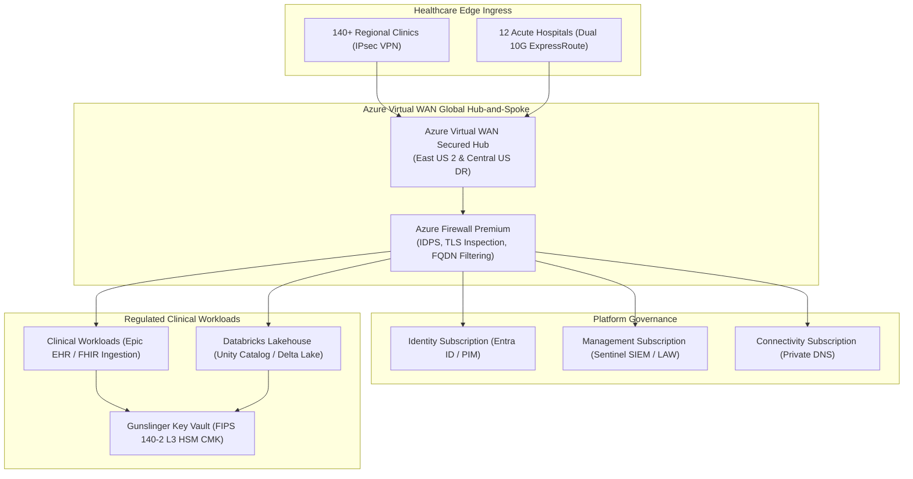

# Mosaic Healthcare Enterprise Cloud Architecture & M&A Governance Portal

[](https://github.com/FreeFades2Black/mosaic-health-cloud-architecture/actions/workflows/deploy.yml)
[](https://freefades2black.github.io/mosaic-health-cloud-architecture/)
[](https://freefades2black.github.io/mosaic-health-cloud-architecture/compliance-hitrust/)
[](https://freefades2black.github.io/mosaic-health-cloud-architecture/landing-zone/)
[](Dockerfile)
[](LICENSE)

---

## 🌐 Live GitHub Pages Portal Location

> ### 🔗 **Primary Live Portal:** [https://freefades2black.github.io/mosaic-health-cloud-architecture/](https://freefades2black.github.io/mosaic-health-cloud-architecture/)
> Hosted directly on **GitHub Pages** via automated GitHub Actions continuous delivery from the `gh-pages` branch.

### 📍 Direct Live Route Index

| Portal Section | Live GitHub Pages Location | Focus Area |
| :--- | :--- | :--- |
| **🏠 Portal Home** | [Portal Index](https://freefades2black.github.io/mosaic-health-cloud-architecture/) | Executive summary, four pillars, system context topology, and governance overview. |
| **☁️ Azure Landing Zone** | [Landing Zone Overview](https://freefades2black.github.io/mosaic-health-cloud-architecture/landing-zone/) | Microsoft Cloud Adoption Framework (CAF) healthcare foundation. |
| **🏢 Management Groups** | [Management Group Hierarchy](https://freefades2black.github.io/mosaic-health-cloud-architecture/landing-zone/management-groups/) | Hierarchical subscription placement, root Azure Policy sets, and Subscription Vending Machine (SVM). |
| **🌐 Hybrid Networking** | [vWAN & Hybrid Backbone](https://freefades2black.github.io/mosaic-health-cloud-architecture/landing-zone/hybrid-networking/) | Azure Virtual WAN Secured Hub, 10G ExpressRoute, Dual IPsec VPN, and Azure Firewall Premium IDPS. |
| **🔐 Identity & Access** | [Entra ID, PIM & Zero-Trust](https://freefades2black.github.io/mosaic-health-cloud-architecture/landing-zone/identity-access/) | Hybrid identity synchronization, Phishing-Resistant FIDO2 MFA, and Just-in-Time (JIT) PIM elevation. |
| **📋 M&A Due Diligence** | [Due Diligence Checklist](https://freefades2black.github.io/mosaic-health-cloud-architecture/ma-playbook/due-diligence-checklist/) | 8-pillar technical discovery audit (Active Directory, VMware, SAN, CIDR overlap, cyber risk). |
| **⚡ Wave Migration** | [Wave Sequencer & Rollback](https://freefades2black.github.io/mosaic-health-cloud-architecture/ma-playbook/wave-migration-sequencer/) | 5-R workload rationalization, 4-phase cutover schedule, Go/No-Go gates, and automated rollback triggers. |
| **🛡️ HITRUST Control Matrix** | [Control Mapping Matrix](https://freefades2black.github.io/mosaic-health-cloud-architecture/compliance-hitrust/control-mapping-matrix/) | Searchable ledger mapping HIPAA § 164.312 and HITRUST CSF v11 domains to technical Azure controls. |
| **📊 Centralized Logging** | [Audit Evidence Pipeline](https://freefades2black.github.io/mosaic-health-cloud-architecture/compliance-hitrust/audit-evidence-logging/) | 730-day hot analytics in Log Analytics Workspace + 7-year immutable WORM archive in Azure Blob Storage. |
| **🗺️ Multi-Cloud Matrix** | [AWS vs GCP vs Azure](https://freefades2black.github.io/mosaic-health-cloud-architecture/multicloud-matrix/aws-gcp-azure-mapping/) | Rosetta Stone translation table across IAM, Transit Networking, Object Storage, and SIEM. |
| **⚖️ Workload Rationalization**| [Migration Decision Framework](https://freefades2black.github.io/mosaic-health-cloud-architecture/multicloud-matrix/migration-rationalization/) | Economic and clinical latency decision tree for consolidating acquired cloud assets. |
| **📜 ARB Decision Registry** | [ADR Index](https://freefades2black.github.io/mosaic-health-cloud-architecture/arb-adrs/) | Architecture Review Board governance charter and formal decision lifecycle. |
| **📝 ADR-001 (vWAN)** | [ADR-001: vWAN Ingress](https://freefades2black.github.io/mosaic-health-cloud-architecture/arb-adrs/adr-001-vwan-hub-spoke/) | Adoption of Azure Virtual WAN Secured Hub for 140+ clinic network ingress. |
| **🔑 ADR-002 (CMK)** | [ADR-002: Key Vault CMK](https://freefades2black.github.io/mosaic-health-cloud-architecture/arb-adrs/adr-002-key-vault-cmk/) | Customer-Managed Keys via FIPS 140-2 Level 3 HSM for all clinical data stores. |
| **🤝 ADR-003 (M&A Tenant)** | [ADR-003: Tenant Consolidation](https://freefades2black.github.io/mosaic-health-cloud-architecture/arb-adrs/adr-003-tenant-consolidation/) | 3-phase cross-tenant coexistence model for zero clinical disruption during mergers. |
| **🏗️ Terraform Module** | [Gunslinger Secure Vault](https://freefades2black.github.io/mosaic-health-cloud-architecture/mosaic_key_vault_module/) | Annotated production Terraform module with private endpoints and auto-rotation policies. |

---

## 📂 Repository File & Directory Structure

```
mosaic-health-cloud-architecture/
├── .github/
│   └── workflows/
│       └── deploy.yml                        # GitHub Actions CI/CD (Test & Deploy to GitHub Pages)
├── docs/
│   ├── index.md                              # Portal Home & Executive Architecture Overview
│   ├── mosaic_key_vault_module.md            # Gunslinger Key Vault Blueprint Documentation
│   ├── stylesheets/
│   │   └── extra.css                         # Custom Enterprise Portal Styles (Teal theme, badges, tables)
│   ├── landing-zone/
│   │   ├── index.md                          # Azure Landing Zone & Hybrid Backbone Overview
│   │   ├── management-groups.md              # Management Group Hierarchy (Root -> Platform -> Workloads)
│   │   ├── hybrid-networking.md              # Hub-and-Spoke, vWAN, ExpressRoute, Dual IPsec VPN, Azure FW
│   │   └── identity-access.md                # Entra ID Hybrid Sync, Conditional Access, PIM Workflows
│   ├── ma-playbook/
│   │   ├── index.md                          # M&A Due Diligence & Workload Migration Engine Overview
│   │   ├── due-diligence-checklist.md        # Discovery Checklist (VMware, SAN, AD levels, Public cloud)
│   │   └── wave-migration-sequencer.md       # 5-R Rationalization, Phase 0/1/2 Cutover & Rollback triggers
│   ├── compliance-hitrust/
│   │   ├── index.md                          # HIPAA & HITRUST CSF Framework Overview
│   │   ├── control-mapping-matrix.md         # Searchable Table: HITRUST controls to Azure technical controls
│   │   └── audit-evidence-logging.md         # Diagnostic log forwarding to Log Analytics & Sentinel
│   ├── multicloud-matrix/
│   │   ├── index.md                          # Multi-Cloud Rosetta Stone Overview
│   │   ├── aws-gcp-azure-mapping.md          # AWS/GCP to Azure Service Translation Table
│   │   └── migration-rationalization.md      # Retain vs Migrate decision framework
│   └── arb-adrs/
│       ├── index.md                          # Architecture Decision Records Index & Governance Charter
│       ├── adr-001-vwan-hub-spoke.md         # ADR-001: Adoption of vWAN Hub-Spoke for Clinic Ingress
│       ├── adr-002-key-vault-cmk.md          # ADR-002: Key Vault CMK for all PHI Data Stores
│       └── adr-003-tenant-consolidation.md   # ADR-003: Tenant Consolidation Strategy (Coexistence vs Cutover)
├── terraform/
│   └── gunslinger-secure-vault/
│       ├── main.tf                           # HITRUST-compliant Key Vault with private endpoints (Annotated)
│       ├── variables.tf                      # Annotated variables with regex validation rules
│       ├── outputs.tf                        # Resource ID, Vault URI, CMK Key ID outputs (Annotated)
│       └── terraform.tfvars.example          # Sanitized enterprise example parameters
├── tests/
│   └── test_portal_build.py                  # Automated test suite validating all pages, ADRs, and Terraform
├── Dockerfile                                # Multi-stage production container (Python builder + Nginx runner)
├── docker-compose.yml                        # Local testing service mapping port 8000
├── .dockerignore                             # Docker build ignore rules
├── .gitignore                                # Git ignore rules for Python, MkDocs, and Terraform
├── mkdocs.yml                                # Material theme, search, Mermaid2, dark/light toggle
├── mosaic_key_vault_module.md                # Root reference blueprint document
├── pyproject.toml                            # Python project metadata and pytest configuration
├── requirements.txt                          # Python dependencies for MkDocs Material and pytest
└── README.md                                 # Comprehensive enterprise portal guide
```

---

## 🏛️ Executive Architecture Overview

The **Mosaic Health Cloud Architecture & M&A Governance Portal** delivers a unified single source of truth for an integrated healthcare delivery network of **140+ acute care hospitals, regional medical centers, ambulatory clinics, and research laboratories**.



---

## 🛡️ Four Core Architectural Pillars

### 1. [Azure Landing Zone & Hybrid Backbone](https://freefades2black.github.io/mosaic-health-cloud-architecture/landing-zone/)
* **Management Group Hierarchy:** Multi-tier structure (`Root` &rarr; `Platform` &rarr; `Landing Zones` &rarr; `Sandboxes`) enforcing baseline Azure Policies for zero public IPs, TLS 1.3 enforcement, and regional pinning (`eastus2` / `centralus`).
* **Hybrid Networking:** Azure Virtual WAN Secured Hub with Azure Firewall Premium IDPS, ExpressRoute Direct 10Gbps with MACsec, and active-active BGP VPN failover for 140+ clinics.
* **Identity Plane:** Microsoft Entra ID hybrid sync, Phishing-Resistant FIDO2 MFA, Conditional Access, and Just-in-Time (JIT) Privileged Identity Management (PIM).

### 2. [M&A Due Diligence & Workload Migration Engine](https://freefades2black.github.io/mosaic-health-cloud-architecture/ma-playbook/)
* **Technical Discovery Checklist:** 8-pillar pre-acquisition audit (Active Directory forest functional levels, hypervisors, SAN storage IOPS, network CIDRs, cyber risk).
* **Wave Migration Sequencer:** 5-R workload rationalization (Rehost, Replatform, Refactor, Retain, Retire), 4-phase cutover schedule, and automated metric rollback triggers (latency > 45ms, DB replication lag > 120s).

### 3. [Compliance & HITRUST CSF Framework](https://freefades2black.github.io/mosaic-health-cloud-architecture/compliance-hitrust/)
* **Control Mapping Matrix:** Searchable ledger mapping HIPAA Security Rule § 164.312 and HITRUST CSF v11 domains to technical Azure controls and continuous Azure Policy evaluation.
* **Centralized Diagnostic Pipeline:** 730-day hot analytics in Log Analytics Workspace + 7-year immutable WORM archive in Azure Blob Storage with Legal Hold.

### 4. [Multi-Cloud Rosetta Stone](https://freefades2black.github.io/mosaic-health-cloud-architecture/multicloud-matrix/)
* **Cross-Cloud Parity Table:** Exhaustive mapping of IAM, Transit Networking, Object Storage, Container Orchestration, and SIEM across Azure, AWS, and GCP.
* **Migration vs Retention Framework:** Economic and clinical latency decision tree for consolidating acquired cloud assets into Azure.

---

## 📜 Architecture Decision Records (ADRs)

All core architectural decisions are formalized following Michael Nygard's format:
* **[ADR-001: Azure Virtual WAN Secured Hub Adoption for Clinic Ingress](https://freefades2black.github.io/mosaic-health-cloud-architecture/arb-adrs/adr-001-vwan-hub-spoke/)** — Replaces legacy distributed mesh NVA routing with centralized Secured Hub routing intent.
* **[ADR-002: Customer-Managed Keys (CMK) via FIPS 140-2 Level 3 HSM for PHI](https://freefades2black.github.io/mosaic-health-cloud-architecture/arb-adrs/adr-002-key-vault-cmk/)** — Enforces RSA-4096 CMK encryption with automated 365-day rotation in Azure Key Vault Premium.
* **[ADR-003: M&A Tenant Consolidation Strategy: Coexistence vs Direct Cutover](https://freefades2black.github.io/mosaic-health-cloud-architecture/arb-adrs/adr-003-tenant-consolidation/)** — Establishes 3-phase coexistence model with cross-tenant sync to prevent clinical disruption.

---

## 🏗️ Reference Infrastructure as Code: Gunslinger Key Vault

The repository includes a production-grade, annotated Terraform module in [`terraform/gunslinger-secure-vault/`](file:///C:/Users/FreeF/projects/mosaic-health-cloud-architecture/terraform/gunslinger-secure-vault/):
* **[`main.tf`](file:///C:/Users/FreeF/projects/mosaic-health-cloud-architecture/terraform/gunslinger-secure-vault/main.tf)**: Key Vault, RSA-4096 HSM Key, Private Endpoint, and Diagnostic Settings with line-by-line notes.
* **[`variables.tf`](file:///C:/Users/FreeF/projects/mosaic-health-cloud-architecture/terraform/gunslinger-secure-vault/variables.tf)**: Parameter declarations with strict validation rules and notes.
* **[`outputs.tf`](file:///C:/Users/FreeF/projects/mosaic-health-cloud-architecture/terraform/gunslinger-secure-vault/outputs.tf)**: Vault URI, Resource ID, and Private Endpoint IP with notes.
* **[`terraform.tfvars.example`](file:///C:/Users/FreeF/projects/mosaic-health-cloud-architecture/terraform/gunslinger-secure-vault/terraform.tfvars.example)**: Sanitized enterprise parameter template.
* Comprehensive blueprint guide: **[`mosaic_key_vault_module.md`](file:///C:/Users/FreeF/projects/mosaic-health-cloud-architecture/mosaic_key_vault_module.md)**.

---

## 🏢 Enterprise Operational Prerequisites

To operate this architecture in a real-world enterprise production healthcare environment:

1. **Azure Enterprise Agreement (EA) / Microsoft Customer Agreement (MCA):**
   * Active Azure tenant root access with Management Group hierarchy permissions.
2. **Microsoft Entra ID P2 & Intune Licensing:**
   * Required for Conditional Access risk-based policies, Privileged Identity Management (PIM), and Access Reviews.
3. **Dedicated Telecommunications Circuits:**
   * Dual 10Gbps ExpressRoute circuits (Primary: East US 2 via Equinix Ashburn; Secondary: Central US via Equinix Chicago) with BGP ASN `65010`.
4. **Hardware Security Module (HSM) Quotas:**
   * Dedicated FIPS 140-2 Level 3 HSM partition allocation in Azure Key Vault Premium.
5. **Log Analytics & SIEM Capacity:**
   * Minimum 100 GB/day ingestion commitment tier for centralized Log Analytics and Microsoft Sentinel.
6. **Terraform Remote State & CI/CD Runners:**
   * Remote state backend configured in geo-redundant storage with state locking. Self-hosted GitHub Actions runners deployed in isolated Spoke VNets with Workload Identity Federation.

---

## 🧪 Local Development & Verification

### Prerequisites
* Python 3.11+
* Docker & Docker Compose (optional for containerized serving)

### Run Automated Governance Test Suite
```bash
# Install dependencies
pip install -r requirements.txt

# Run pytest suite
pytest tests/ -v
```

### Serve Portal Locally
```bash
# Start local development server with live reload
mkdocs serve -a 127.0.0.1:8000
```
Navigate to `http://localhost:8000` to view the live portal.

### Run in Docker Container
```bash
# Build and run multi-stage production container
docker compose up --build -d

# Verify container health
curl -s http://localhost:8000/healthz
```

---

## 📄 License & Architecture Review Board

Copyright &copy; 2026 Mosaic Healthcare Enterprise Architecture & Infrastructure Operations.  
Licensed under the **Apache-2.0 License**.
