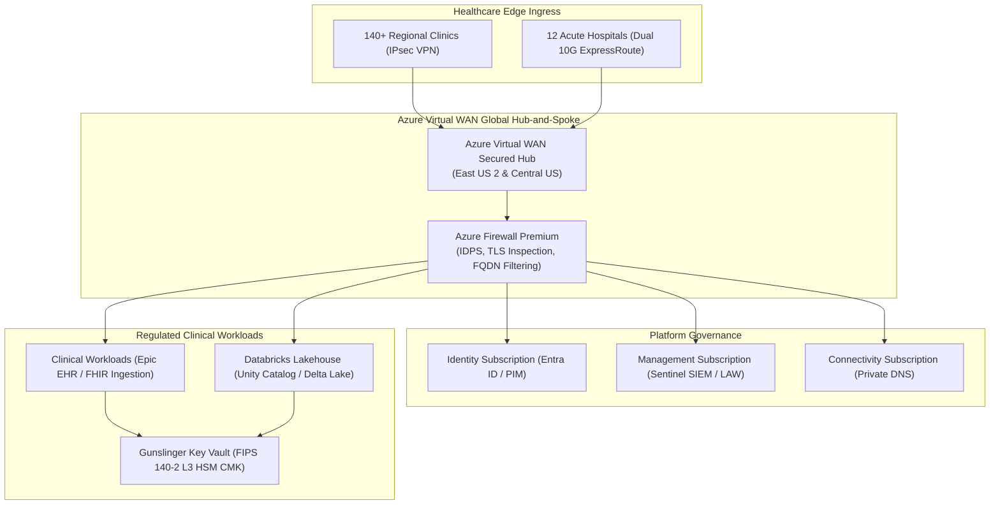

# Mosaic Healthcare Enterprise Cloud Architecture & M&A Governance Portal

[](https://github.com/FreeFades2Black/mosaic-health-cloud-architecture/actions/workflows/deploy.yml)
[](https://freefades2black.github.io/mosaic-health-cloud-architecture/)
[](https://freefades2black.github.io/mosaic-health-cloud-architecture/compliance-hitrust/)
[](https://freefades2black.github.io/mosaic-health-cloud-architecture/landing-zone/)
[](Dockerfile)
[](LICENSE)

> **Live Interactive Portal:** [https://freefades2black.github.io/mosaic-health-cloud-architecture/](https://freefades2black.github.io/mosaic-health-cloud-architecture/)

---

## 1. Executive Portal Overview

The **Mosaic Health Cloud Architecture & M&A Governance Portal** is an interactive, enterprise-grade architectural blueprint and operational single source of truth hosted directly on **GitHub Pages**.

It mirrors the exact deliverable an **Enterprise Cloud Architect** delivers to an **Architecture Review Board (ARB)**, clinical informatics squads, infrastructure engineering teams, and executive stakeholders (CIO, CISO, Chief Medical Officer) across a regional healthcare network of **140+ acute care hospitals, regional medical centers, ambulatory clinics, and research laboratories**.



---

## 2. Four Core Architectural Pillars

### 1. [Azure Landing Zone & Hybrid Backbone](https://freefades2black.github.io/mosaic-health-cloud-architecture/landing-zone/)
- **Management Group Hierarchy:** Multi-tier structure (`Root` &rarr; `Platform` &rarr; `Landing Zones` &rarr; `Sandboxes`) enforcing baseline Azure Policies for zero public IPs, TLS 1.3 enforcement, and regional pinning.
- **Hybrid Networking:** Azure Virtual WAN Secured Hub with Azure Firewall Premium IDPS, ExpressRoute Direct 10Gbps with MACsec, and active-active BGP VPN failover.
- **Identity Plane:** Microsoft Entra ID hybrid sync, Phishing-Resistant FIDO2 MFA, Conditional Access, and Just-in-Time (JIT) Privileged Identity Management (PIM).

### 2. [M&A Due Diligence & Workload Migration Engine](https://freefades2black.github.io/mosaic-health-cloud-architecture/ma-playbook/)
- **Technical Discovery Checklist:** 8-pillar pre-acquisition audit (Active Directory forest functional levels, hypervisors, SAN storage IOPS, network CIDRs, cyber risk).
- **Wave Migration Sequencer:** 5-R workload rationalization (Rehost, Replatform, Refactor, Retain, Retire), 4-phase cutover schedule, and automated metric rollback triggers (latency > 45ms, DB replication lag > 120s).

### 3. [Compliance & HITRUST CSF Framework](https://freefades2black.github.io/mosaic-health-cloud-architecture/compliance-hitrust/)
- **Control Mapping Matrix:** Searchable ledger mapping HIPAA Security Rule § 164.312 and HITRUST CSF v11 domains to technical Azure controls and continuous Azure Policy evaluation.
- **Centralized Diagnostic Pipeline:** 730-day hot analytics in Log Analytics Workspace + 7-year immutable WORM archive in Azure Blob Storage with Legal Hold.

### 4. [Multi-Cloud Rosetta Stone](https://freefades2black.github.io/mosaic-health-cloud-architecture/multicloud-matrix/)
- **Cross-Cloud Parity Table:** Exhaustive mapping of IAM, Transit Networking, Object Storage, Container Orchestration, and SIEM across Azure, AWS, and GCP.
- **Migration vs Retention Framework:** Economic and clinical latency decision tree for consolidating acquired cloud assets into Azure.

---

## 3. Architecture Decision Records (ADRs)

All core architectural decisions are formalized following Michael Nygard's format:
- **[ADR-001: Azure Virtual WAN Secured Hub Adoption for Clinic Ingress](https://freefades2black.github.io/mosaic-health-cloud-architecture/arb-adrs/adr-001-vwan-hub-spoke/)** — Replaces legacy distributed mesh NVA routing with centralized Secured Hub routing intent.
- **[ADR-002: Customer-Managed Keys (CMK) via FIPS 140-2 Level 3 HSM for PHI](https://freefades2black.github.io/mosaic-health-cloud-architecture/arb-adrs/adr-002-key-vault-cmk/)** — Enforces RSA-4096 CMK encryption with automated 365-day rotation in Azure Key Vault Premium.
- **[ADR-003: M&A Tenant Consolidation Strategy: Coexistence vs Direct Cutover](https://freefades2black.github.io/mosaic-health-cloud-architecture/arb-adrs/adr-003-tenant-consolidation/)** — Establishes 3-phase coexistence model with cross-tenant sync to prevent clinical disruption.

---

## 4. Reference Infrastructure as Code: Gunslinger Key Vault

The repository includes a production-grade, annotated Terraform module in [`terraform/gunslinger-secure-vault/`](file:///C:/Users/FreeF/projects/mosaic-health-cloud-architecture/terraform/gunslinger-secure-vault/):
- **[`main.tf`](file:///C:/Users/FreeF/projects/mosaic-health-cloud-architecture/terraform/gunslinger-secure-vault/main.tf)**: Key Vault, RSA-4096 HSM Key, Private Endpoint, and Diagnostic Settings.
- **[`variables.tf`](file:///C:/Users/FreeF/projects/mosaic-health-cloud-architecture/terraform/gunslinger-secure-vault/variables.tf)**: Parameter declarations with strict validation rules.
- **[`outputs.tf`](file:///C:/Users/FreeF/projects/mosaic-health-cloud-architecture/terraform/gunslinger-secure-vault/outputs.tf)**: Vault URI, Resource ID, and Private Endpoint IP.
- **[`terraform.tfvars.example`](file:///C:/Users/FreeF/projects/mosaic-health-cloud-architecture/terraform/gunslinger-secure-vault/terraform.tfvars.example)**: Sanitized values template.
- Comprehensive blueprint guide: **[`mosaic_key_vault_module.md`](file:///C:/Users/FreeF/projects/mosaic-health-cloud-architecture/mosaic_key_vault_module.md)**.

---

## 5. Enterprise Operational Prerequisites

To operate this architecture in a real-world enterprise production healthcare environment:

1. **Azure Enterprise Agreement (EA) / Microsoft Customer Agreement (MCA):**
   - Active Azure tenant root access with Management Group hierarchy permissions.
2. **Microsoft Entra ID P2 & Intune Licensing:**
   - Required for Conditional Access risk-based policies, Privileged Identity Management (PIM), and Access Reviews.
3. **Dedicated Telecommunications Circuits:**
   - Dual 10Gbps ExpressRoute circuits (Primary: East US 2 via Equinix Ashburn; Secondary: Central US via Equinix Chicago) with BGP ASN `65010`.
4. **Hardware Security Module (HSM) Quotas:**
   - Dedicated FIPS 140-2 Level 3 HSM partition allocation in Azure Key Vault Premium.
5. **Log Analytics & SIEM Capacity:**
   - Minimum 100 GB/day ingestion commitment tier for centralized Log Analytics and Microsoft Sentinel.
6. **Terraform Remote State & CI/CD Runners:**
   - Remote state backend configured in geo-redundant storage with state locking. Self-hosted GitHub Actions runners deployed in isolated Spoke VNets with Workload Identity Federation.

---

## 6. Local Development & Verification

### Prerequisites
- Python 3.11+
- Docker & Docker Compose (optional for containerized serving)

### Run Automated Governance Test Suite
```bash
# Install dependencies
pip install -r requirements.txt

# Run pytest suite
pytest tests/ -v
```

### Serve Portal Locally
```bash
# Start local development server with live reload
mkdocs serve -a 127.0.0.1:8000
```
Navigate to `http://localhost:8000` to view the live portal.

### Run in Docker Container
```bash
# Build and run multi-stage production container
docker compose up --build -d

# Verify container health
curl -s http://localhost:8000/healthz
```

---

## 7. License & Architecture Review Board

Copyright &copy; 2026 Mosaic Healthcare Enterprise Architecture & Infrastructure Operations.  
Licensed under the **Apache-2.0 License**.
