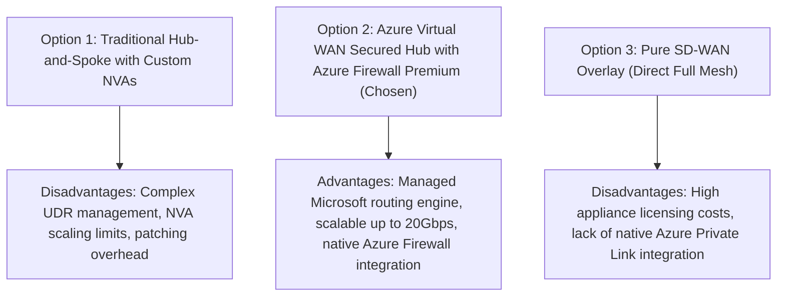
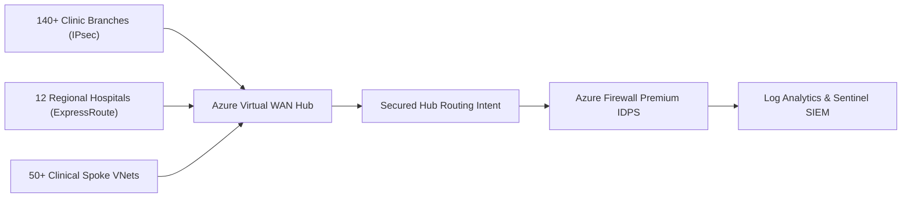

# ADR-001: Azure Virtual WAN Secured Hub Adoption for Clinic Ingress

Status: ACCEPTED
Date: 2026-08-15
HITRUST Control 09.0

---

## 1. Context & Problem Statement

Mosaic Healthcare operates over 140 ambulatory clinics, 12 regional acute care hospitals, and numerous diagnostic outpatient centers. Previously, cloud connectivity relied on a traditional hub-and-spoke VNet topology utilizing third-party Network Virtual Appliances (NVAs) deployed in high-availability pairs with User Defined Routes (UDRs).

As clinic acquisition accelerated, this legacy model faced severe operational limits:
1. **Routing Table Sprawl:** Exceeded 400+ custom UDR entries across spokes, leading to human error during route updates.
2. **Bandwidth Bottlenecks:** NVA clusters encountered CPU saturation during large DICOM imaging transfers (> 5Gbps bursts).
3. **High Management Overhead:** Patching and maintaining redundant NVA Linux clusters introduced clinical downtime risks.

---

## 2. Decision Drivers

- **Scale & Automation:** Must seamlessly support 200+ connected branch clinics and 50+ workload spoke VNets without manual route table edits.
- **Micro-Segmentation & Security:** Centralized IDPS inspection and TLS 1.3 termination for all spoke-to-spoke and branch-to-cloud clinical traffic.
- **High Availability & Resiliency:** Active-active multi-gateway architecture with automated SLA-backed failover (< 30 seconds).
- **Compliance:** Enforce strict logging of all network flows to Microsoft Sentinel (HITRUST 09.0).

---

## 3. Considered Options

---

## 4. Decision Outcome

**Chosen Architecture:** **Option 2 — Azure Virtual WAN Secured Virtual Hub with Azure Firewall Premium**.

Mosaic Healthcare will deploy dual Azure Virtual WAN Hubs in `East US 2` (Primary) and `Central US` (Disaster Recovery). Spoke VNets and branch clinic VPN/ExpressRoute circuits connect directly to the Secured Hub with **Routing Intent** enabled, automatically directing all private (RFC 1918) and public (0.0.0.0/0) traffic through Azure Firewall Premium without manual UDR tables.

---

## 5. Consequences & Trade-Offs

### Positive Consequences
- **Elimination of UDR Management:** Routing Intent automates default and inter-spoke route injection across all 50+ VNets.
- **Massive Scalability:** vWAN Hub gateways scale automatically up to 20Gbps throughput, accommodating peak PACS imaging bursts.
- **Centralized Threat Defense:** Azure Firewall Premium provides 67,000+ healthcare-specific IDPS signatures and URL filtering in a single managed control plane.

### Managed Trade-Offs
- **Cost:** vWAN Hub and Azure Firewall Premium incur base hourly charges plus data processing fees ($0.016/GB), which is offset by retiring legacy third-party NVA licenses and reduced operational labor.
- **Custom Route Flexibility:** Highly specialized multi-hop asymmetric routing scenarios are constrained by vWAN's standardized routing policies.

---

## 6. Compliance & Security Mapping

- **HIPAA Security Rule § 164.312(e)(1):** Transmission Security — Enforces IPsec IKEv2 with AES-GCM-256 for all clinic connections.
- **HITRUST CSF v11 Domain 09.0:** Communications Security — All inter-subnet and outbound internet traffic is inspected by stateful firewall and logged to Sentinel.
