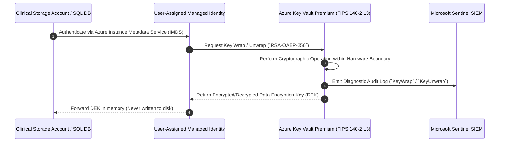

# ADR-002: Customer-Managed Keys (CMK) via FIPS 140-2 Level 3 HSM for PHI

Status: ACCEPTED
Date: 2026-08-22
HITRUST Control 02.0

---

## 1. Context & Problem Statement

Mosaic Healthcare stores petabytes of sensitive electronic Protected Health Information (ePHI), including patient longitudinal medical histories, genomic sequences, DICOM radiology studies, and billing records across Azure Blob Storage, Azure SQL Database, Azure Cosmos DB, and Databricks Delta Lake.

While Azure provides default encryption at rest using platform-managed keys (Microsoft-Managed Keys / MMK), regulatory standards (HITRUST CSF v11 Level 3 certification and enterprise cyber insurance mandates) require that Mosaic Healthcare maintains exclusive cryptographic custody of all encryption root keys.

---

## 2. Decision Drivers

- **Cryptographic Custody (Zero-Knowledge):** Cloud service provider engineers must have no cryptographic capability to decrypt stored PHI data under any legal or technical subpoena.
- **Hardware Security Level:** Root keys must be protected within dedicated Hardware Security Modules certified to **FIPS 140-2 Level 3**.
- **Cryptographic Erasure / Instant Revocation:** Ability to instantly render all clinical data unreadable by revoking or disabling the master CMK in the event of an existential security breach.
- **Automated Lifecycle & Key Rotation:** Automated 365-day key rotation without clinical application downtime or re-encryption overhead.

---

## 3. Considered Options

| Architecture Option | HSM Certification Tier | Key Custody Model | Cryptographic Erasure | Selected? |
| :--- | :--- | :--- | :--- | :--- |
| **Option 1: Microsoft-Managed Keys (MMK)** | Multi-tenant Software / FIPS 140-2 L1 | Microsoft Owned & Managed | No (Shared Platform Key) | **Rejected** (Fails HITRUST CMK requirements) |
| **Option 2: Azure Key Vault Standard (CMK)** | FIPS 140-2 Level 2 (Software Protected) | Mosaic Owned | Yes | **Rejected** (Lacks hardware security module backing) |
| **Option 3: Azure Key Vault Premium HSM (CMK)** | **FIPS 140-2 Level 3 (Dedicated HSM)** | **Mosaic Owned & Managed** | **Yes (Instant Key Disable)** | **ACCEPTED** (Meets all HITRUST & Cyber Insurance gates) |

---

## 4. Decision Outcome

**Chosen Architecture:** **Option 3 — Azure Key Vault Premium with FIPS 140-2 Level 3 HSM Customer-Managed Keys (RSA-4096)**.

All clinical storage accounts, databases, managed disks, and event streaming brokers must use User-Assigned Managed Identities (UAMI) to wrap and unwrap data encryption keys (DEKs) against the master Key Encryption Key (KEK) stored in Azure Key Vault Premium.

---

## 5. Consequences & Enforced Security Guardrails

### Positive Consequences
- **True Cryptographic Custody:** Complete cryptographic independence from cloud infrastructure provider operators.
- **Instant Revocation Capability:** Provides cryptographic shredding (crypto-erasure) across all ePHI data stores within milliseconds by disabling the master KEK.
- **Audit Logging of All Operations:** Every `KeyWrap` / `KeyUnwrap` API call is streamed to Microsoft Sentinel with full identity provenance.

### Enforced Security Guardrails
1. **Purge Protection Enabled:** Soft-delete retention set to `90 days` with Purge Protection locked permanently (`purge_protection_enabled = true`). Prevents malicious deletion even by tenant Global Administrators.
2. **Private Link Only:** Public network access explicitly disabled (`public_network_access_enabled = false`). All access routes through private endpoints in `sub-mosaic-conn-prod-01`.
3. **Automated Key Rotation Policy:** Key rotation policy configured to generate a new key version automatically every 365 days, notifying the ARB via Event Grid 30 days prior to expiry.

---

## 6. Compliance & Security Mapping

- **HIPAA Security Rule § 164.312(a)(2)(iv):** Encryption and Decryption — Mandates robust algorithmic encryption at rest for all electronic media.
- **HITRUST CSF v11 Control 02.0:** Cryptographic Protection — Requires hardware security module root key generation, key separation of duties, and auditable key rotation lifecycles.
