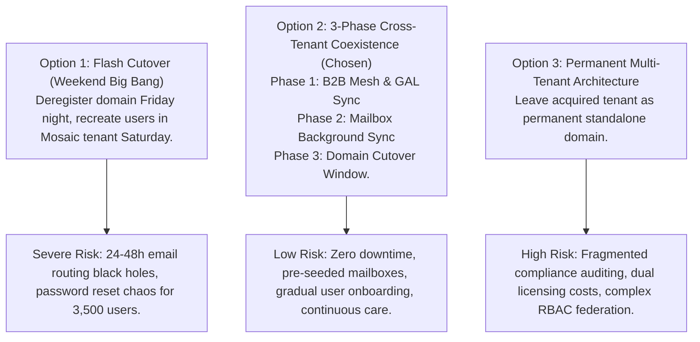
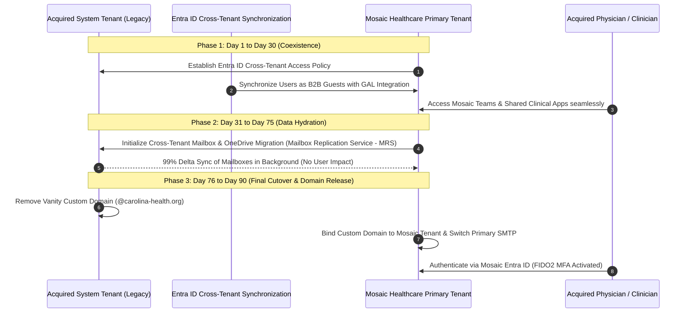

# ADR-003: M&A Tenant Consolidation Strategy: Coexistence vs Direct Cutover

Status: ACCEPTED
Date: 2026-08-29
HITRUST Control 01.0

---

## 1. Context & Problem Statement

Upon acquiring a regional healthcare system (e.g. Carolina Health Partners with 22 clinic locations and 3,500 clinical staff), Mosaic Healthcare must integrate the acquired Microsoft Entra ID (Azure AD) and Microsoft 365 tenant into the primary Mosaic corporate tenant (`mosaic-healthcare.org`).

Clinical staff rely continuously on Outlook calendar scheduling, Teams clinical handoff communications, EHR single sign-on (SSO), and SharePoint clinical policies. An unplanned disruption or prolonged email outage creates clinical safety risks in high-acuity patient care environments.

---

## 2. Decision Drivers

- **Zero Clinical Disruption:** No interruption in physician paging, clinical multidisciplinary team chats, or patient notification systems.
- **Unified Global Address List (GAL):** Day-1 mutual discoverability of physicians across both legacy and acquirer organizations.
- **HIPAA Compliance During Migration:** Ensure all email, telemetry, and shared documents remain subject to Mosaic data loss prevention (DLP) and retention policies during transit.
- **Reversibility:** Low-risk rollback capability if domain deregistration encounters unforeseen upstream DNS propagation delays.

---

## 3. Considered Options

---

## 4. Decision Outcome

**Chosen Architecture:** **Option 2 — 3-Phase Cross-Tenant Coexistence Strategy**.

---

## 5. Consequences & Trade-Offs

### Positive Consequences
- **Zero Intersystem Blackouts:** Pre-seeding mailboxes and OneDrive data via native Microsoft Mailbox Replication Service (MRS) reduces cutover window to under 15 minutes per batch.
- **Day-1 Collaboration:** Clinicians can search the unified Global Address List and join cross-functional clinical boards on day one of the merger.
- **Full Regulatory Governance:** Mosaic Purview DLP policies and Sentinel audit rules apply to B2B interactions throughout the coexistence phase.

### Managed Trade-Offs
- **Duration:** The 3-phase model spans 60 to 90 days rather than a single weekend, requiring sustained project management.
- **Licensing Overlap:** Temporary dual-licensing costs during the migration period (~$8/user/month for 60 days) are budgeted as an M&A operational expense.

---

## 6. Compliance & Security Mapping

- **HIPAA Security Rule § 164.308(a)(1)(ii)(D):** Information System Activity Review — Maintains continuous logging in Sentinel during cross-tenant data transfers.
- **HITRUST CSF v11 Control 01.0:** Access Control — Enforces Mosaic Conditional Access policies on all incoming B2B guest identities.
