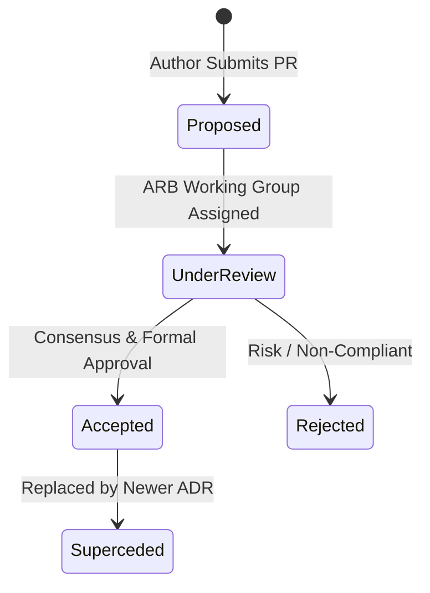

# Architecture Decision Records (ADR) Registry

ARB Governance
Formal Decisions

---

## 1. ARB Decision Governance Charter

The **Mosaic Healthcare Architecture Review Board (ARB)** oversees all structural, security, cryptographic, and cloud foundation design choices. Architecture Decision Records (ADRs) capture critical decisions along with their business context, alternatives considered, trade-offs, and compliance mappings.

### ADR Lifecycle States

---

## 2. Active ADR Registry

| ADR ID | Title | Status | Date Ratified | Primary Architectural Impact |
| :--- | :--- | :--- | :--- | :--- |
| **[ADR-001](adr-001-vwan-hub-spoke.md)** | **Azure Virtual WAN Secured Hub Adoption for 140+ Clinic Network Ingress** | `ACCEPTED` | 2026-08-15 | Migrates from distributed mesh VNet peering to Azure Virtual WAN Secured Hub with Azure Firewall Premium routing intent. |
| **[ADR-002](adr-002-key-vault-cmk.md)** | **Customer-Managed Keys (CMK) via FIPS 140-2 Level 3 HSM for all PHI** | `ACCEPTED` | 2026-08-22 | Mandates RSA-4096 CMK in Azure Key Vault Premium with automated rotation for all clinical data stores. |
| **[ADR-003](adr-003-tenant-consolidation.md)** | **M&A Tenant Consolidation Strategy: Cross-Tenant Coexistence vs Direct Cutover** | `ACCEPTED` | 2026-08-29 | Defines 3-phase coexistence model for M&A identity consolidation, cross-tenant calendar sharing, and domain cutover. |

---

## 3. ADR Format Standard

Every ADR in this repository adheres to Michael Nygard's format extended for Healthcare Compliance:
1. **Status:** `PROPOSED`, `ACCEPTED`, `SUPERSEDED`, or `REJECTED`.
2. **Context & Problem Statement:** Business need, clinical workflow constraints, technical driver.
3. **Decision Drivers:** Regulatory mandates (HIPAA/HITRUST), latency SLOs, cost, operational maintainability.
4. **Considered Options:** Alternatives evaluated with technical comparisons.
5. **Decision Outcome:** Final architecture selection and justification.
6. **Consequences & Trade-Offs:** Positive benefits and managed operational burdens.
7. **Compliance & Security Mapping:** Direct citations of HIPAA/HITRUST control specs.
