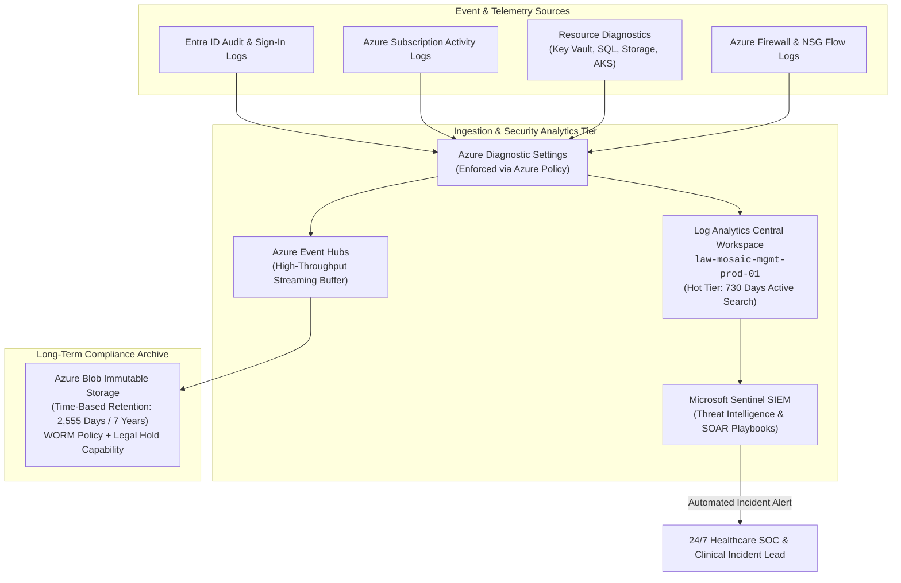

# Audit Evidence & Centralized Logging Pipeline

<span class="badge badge-hitrust">Audit & Accountability</span>
<span class="badge badge-hipaa">7-Year Immutable WORM</span>

---

## 1. Enterprise Diagnostic Logging Pipeline

To satisfy **HIPAA § 164.312(b)** and **HITRUST Domain 09.0**, all system events, network flows, database queries, and identity authentications must be captured in real time, protected from tampering, and retained in an auditable immutable state for a minimum of **7 years**.



---

## 2. Retention Tiers & Lifecycle Management

| Storage Tier | Target Store | Retention Duration | Purpose & Access Pattern | Cost Optimization |
| :--- | :--- | :--- | :--- | :--- |
| **Hot Analytics Tier** | Azure Log Analytics Workspace | **730 Days (2 Years)** | Real-time threat hunting, KQL queries, incident investigation, interactive dashboards. | High performance indexing with daily ingestion commitment tiers. |
| **Archive Compliance Tier** | Azure Immutable Blob Storage | **2,555 Days (7 Years)** | Legal hold, OCR regulatory audits, forensic historical re-construction. | Cold / Archive blob tier with WORM policy locking. |

---

## 3. High-Priority Healthcare Threat Detection Rules (Sentinel)

Microsoft Sentinel is configured with custom healthcare analytics rules detecting anomalous activities on clinical endpoints and cryptographic keys:

### Rule 1: Mass ePHI Data Exfiltration Detection

```kusto
// Detect anomalous bulk download of patient files or database export
StorageBlobLogs
| where TimeGenerated > ago(1h)
| where OperationName == "GetBlob" or OperationName == "CopyBlob"
| summarize TotalBytes = sum(ResponseObjectSize), DownloadCount = count() by CallerIpAddress, AuthenticationType, UserAgent
| where TotalBytes > 10737418240 // > 10 GB in 1 hour
| order by TotalBytes desc
```

### Rule 2: Key Vault Secret Download Outside Maintenance Window

```kusto
// Alert on cryptographic key or secret extraction outside change window
AzureDiagnostics
| where TimeGenerated > ago(15m)
| where ResourceProvider == "MICROSOFT.KEYVAULT"
| where OperationName in ("SecretGet", "KeyDecrypt", "VaultGet")
| extend HourOfDay = hourofday(TimeGenerated)
| where HourOfDay < 6 or HourOfDay > 22 // Outside 06:00 - 22:00
| project TimeGenerated, OperationName, CallerIPAddress, identity_claim_upn_s, ResultSignature
```

### Rule 3: Unapproved PIM Elevation on Clinical Workload

```kusto
// Alert when administrative elevation occurs without linked Jira/ServiceNow change ticket
AuditLogs
| where TimeGenerated > ago(30m)
| where OperationName == "Add member to role in PIM completed"
| extend TargetRole = tostring(TargetResources[0].displayName)
| extend Initiator = tostring(InitiatedBy.user.userPrincipalName)
| where TargetRole in ("Owner", "User Access Administrator", "Key Vault Administrator")
| project TimeGenerated, OperationName, TargetRole, Initiator, Result
```
