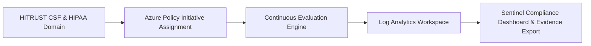

# HITRUST CSF & HIPAA Control Mapping Matrix

<span class="badge badge-hitrust">HITRUST CSF v11</span>
<span class="badge badge-hipaa">HIPAA Control Mapping</span>

---

## 1. Compliance Mapping Matrix Overview

This matrix serves as the auditable compliance ledger for external assessors (HITRUST External Assessor, OCR Auditors) and internal Governance, Risk, and Compliance (GRC) teams. Every technical control is mapped from regulatory specification to Azure cloud configuration and automated policy definition.



---

## 2. Technical Control Mapping Ledger

| HITRUST Domain | HIPAA Spec (45 CFR) | Control Description | Azure Technical Implementation | Azure Policy Definition ID / Rule | Evidence Verification Method |
| :--- | :--- | :--- | :--- | :--- | :--- |
| **01.0 Access Control** | § 164.312(a)(1) Unique User Identification | Enforce unique credentials and prevent shared account usage across all systems. | Microsoft Entra ID with SCIM synchronization and individual federated identity. | `require-unique-user-id` | Entra Sign-In Logs; query distinct `userPrincipalName` on all API calls. |
| **01.0 Access Control** | § 164.312(a)(2)(i) Emergency Access | Maintain emergency "break-glass" procedures with high-priority alerting. | Break-glass cloud accounts stored in sealed physical safes with Sentinel instant alert. | `audit-break-glass-activation` | Sentinel Incident Alert Rule `#SEC-EMERGENCY-01` log output. |
| **01.0 Access Control** | § 164.312(a)(2)(iv) Auto Logoff | Terminate inactive sessions on clinical portals and management consoles. | Entra ID Conditional Access Session Lifetime: 15-minute inactivity timeout. | `entra-ca-session-timeout-15m` | Intune Compliance Policy & Conditional Access JSON export. |
| **02.0 Cryptographic Protection** | § 164.312(a)(2)(iv) Encryption at Rest | Encrypt all ePHI stored on disks, databases, and blob storage with customer keys. | Azure Key Vault Premium HSM; RSA-4096 Customer-Managed Keys (CMK). | `deny-storage-without-cmk`<br/>`deny-sql-without-cmk` | Azure Policy Compliance Score (100%); ARM Resource JSON verification. |
| **03.0 Cryptographic Protection** | § 164.312(e)(1) Transmission Security | Encrypt all data in transit across public and private wide area networks. | Enforce TLS 1.3 minimum on App Services, API Gateways, and Azure Storage. | `deny-tls-below-1-3`<br/>`deny-http-traffic-all` | Azure Firewall TLS Inspection logs; OpenSSL handshake validation. |
| **04.0 Human Resources Security** | § 164.308(a)(3) Workforce Clearance | Revoke access immediately upon employee termination or role transition. | Entra ID Lifecycle Workflows integrated with Workday HR API for instant deprovisioning. | `entra-lifecycle-deprovisioning` | HR offboarding audit log compared with Entra user disable timestamps. |
| **05.0 Physical & Environmental** | § 164.310(a)(1) Facility Access Controls | Restrict physical access to datacenter compute and storage hardware. | Microsoft Azure Datacenter Physical Security certifications (SOC 1/2/3, ISO 27001). | `microsoft-datacenter-attestation` | Annual Microsoft Azure SOC 2 Type II audit report download. |
| **06.0 Operations Security** | § 164.308(a)(5)(ii)(B) Protection from Malicious Software | Deploy automated endpoint threat protection and real-time vulnerability scanning. | Microsoft Defender for Endpoint & Defender for Cloud with continuous agent health checks. | `deploy-defender-agents-vm` | Defender for Cloud Secure Score; EDR agent coverage > 99%. |
| **07.0 Operations Security** | § 164.312(c)(1) Data Integrity | Protect electronic health records from unauthorized alteration or destruction. | Azure Storage Immutable Blob Storage with Time-Based Legal Hold & Purge Protection. | `require-immutable-blob-storage` | Azure Storage Container Policy settings: Immutability enabled. |
| **08.0 Communications Security** | § 164.312(e)(2)(i) Integrity Controls | Enforce network boundary isolation and prevent unauthorized data exfiltration. | Azure Virtual WAN Secured Hub, Azure Firewall Premium IDPS, and Private Link. | `deny-public-ip-workloads`<br/>`require-nsg-associated` | Network Watcher Flow Logs; Zero public IP assignments on production NICs. |
| **09.0 Audit & Accountability** | § 164.312(b) Audit Controls | Record and examine activity in information systems containing or using ePHI. | Azure Monitor Diagnostic Settings forwarding 100% of logs to Central Log Analytics. | `deploy-diagnostic-settings-all` | Log Analytics retention policy: 730 days hot, 7 years immutable cold archive. |
| **10.0 Incident Management** | § 164.308(a)(6) Response and Reporting | Detect, respond to, and document security incidents involving potential ePHI breaches. | Microsoft Sentinel SIEM with automated SOAR playbooks for immediate clinical isolation. | `sentinel-incident-response-rules` | Tabletop incident drill reports; Mean Time to Respond (MTTR) < 15 mins. |

---

## 3. Automated Continuous Audit Verification Query

GRC auditors can execute this automated Kusto Query Language (KQL) query in Azure Resource Graph to verify 100% policy compliance across all subscriptions:

```kusto
// Audit: Verify Zero Public IP Addresses in Clinical Subscriptions
Resources
| where type == "microsoft.network/publicipaddresses"
| join kind=inner (
    ResourceContainers 
    | where type == "microsoft.resources/subscriptions"
    | project subscriptionId, subscriptionName = name, tags
) on subscriptionId
| where subscriptionName contains "clinical" or subscriptionName contains "pacs"
| project subscriptionName, resourceGroup, publicIpName = name, ipAddress = properties.ipAddress, provisioningState = properties.provisioningState
| count
```
*(Target result: `0` records returned)*
