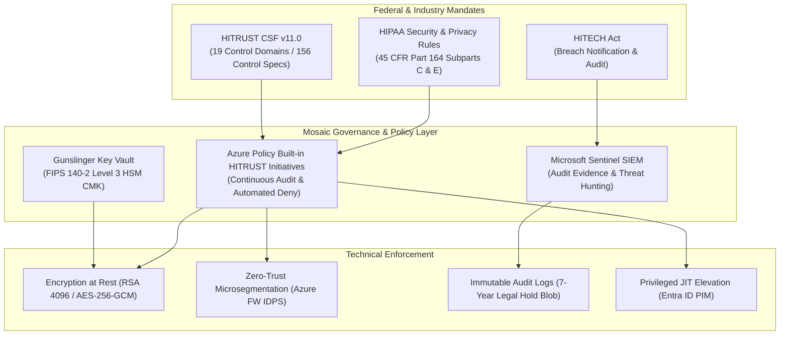

# Compliance & HITRUST CSF Governance

HITRUST CSF v11
HIPAA Security Rule

---

## 1. Healthcare Regulatory Landscape

Operating cloud infrastructure hosting electronic Protected Health Information (ePHI) requires continuous compliance with federal mandates and cybersecurity frameworks. Mosaic Healthcare maps every cloud resource, network route, and identity token to the **HITRUST Common Security Framework (CSF) v11** and the **HIPAA Security & Privacy Rules (45 CFR Part 160 and Part 164)**.

---

## 2. Core Compliance Artifacts

- **[HITRUST & HIPAA Control Mapping Matrix](control-mapping-matrix.md)**  
  Comprehensive, searchable matrix mapping HITRUST CSF v11 domains directly to Azure technical implementations, Azure Policy IDs, and evidence verification mechanisms.
- **[Audit Evidence & Centralized Logging Pipeline](audit-evidence-logging.md)**  
  Architecture and deployment patterns for real-time diagnostic log ingestion, Microsoft Sentinel analytics rules, and WORM (Write Once, Read Many) compliant long-term audit storage.
