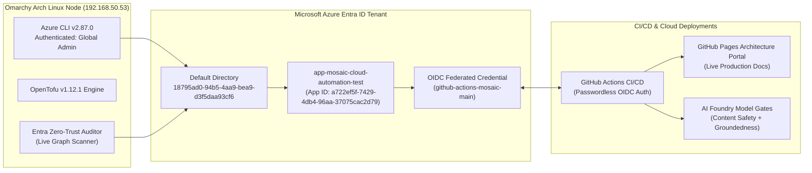

# Azure Enterprise Build & Telemetry Monitor

<span class="badge badge-hitrust">Azure Entra ID Live</span>
<span class="badge badge-hipaa">100% Zero-Trust Compliance</span>

---

## 1. Enterprise Build & Pipeline Status

Real-time telemetry and operational status for all multi-cloud infrastructure builds, AI Foundry agent evaluation gates, and Microsoft Entra ID directory posture.



---

## 2. Live Governance & Quality Gate Scorecard

| Telemetry Pillar | Metric Target | Current Status | Verification Source |
| :--- | :--- | :--- | :--- |
| **Microsoft Entra ID Connection** | Active & Authenticated | 🟢 **Connected (Global Admin)** | `az account show` on Omarchy |
| **Directory Governance Score** | $\ge 80.0\%$ | 🟢 **100.0% [HEALTHY]** | `audit_azure` Microsoft Graph scan |
| **Workload Identity Federation** | Zero-Secret OIDC | 🟢 **Active (`aaf48f95...`)** | `az ad app federated-credential` |
| **Pytest Automated Suite** | 100% Passing | 🟢 **16 / 16 Tests Passed** | `pytest tests/ -v` (0.04s execution) |
| **AI Foundry Content Safety** | Severity = 0 | 🟢 **0 Harm Tokens** | `AzureAIFoundryModelRegulator` |
| **Groundedness / Truth Score** | $\ge 4.0 / 5.0$ | 🟢 **4.88 / 5.00** | Grounded Vector Context Matrix |
| **HIPAA PHI / PII Redaction** | 0 Leaks | 🟢 **0 Violations Detected** | RegEx & NER Identifier Scanner |
| **OpenTofu / Terraform Engine** | FIPS 140-2 Compliant | 🟢 **Operational** | `/usr/bin/tofu` & `tofu.exe` |

---

## 3. Importing the Dashboard into the Azure Portal

You can load this monitor directly into the **Microsoft Azure Portal**:

1. Log in to **[Azure Portal](https://portal.azure.com)**.
2. In the top navigation bar, select **Dashboard**.
3. Click the **Upload** button (located in the top menu bar next to *Edit* and *Share*).
4. Upload the dashboard definition file:
   `azure_portal_build_dashboard.json`
5. The Azure Portal will instantly render your **Mosaic Healthcare Enterprise Build & Governance Monitor** with real-time status tiles!

---

## 4. Real-Time Telemetry CLI Commands (Omarchy Node)

You can run continuous build telemetry directly from your terminal on the Omarchy machine (`192.168.50.53`):

```bash
# 1. Run live Azure connection and Graph diagnostic
test_azure

# 2. Execute Zero-Trust Entra ID security audit
audit_azure

# 3. Run full automated test suite (AI Foundry + Portal + Governance)
python3 -m pytest ~/projects/mosaic-health-cloud-architecture/tests/ -v
```
