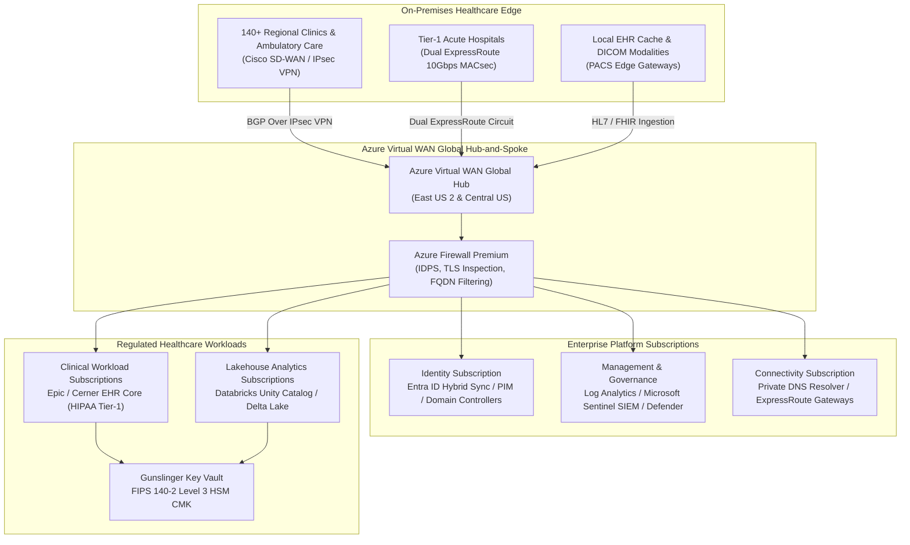

# Mosaic Healthcare Enterprise Cloud Architecture & M&A Governance Portal

Production Ready
HITRUST CSF v11
HIPAA Compliant
ARB Approved

---

## Executive Summary

Welcome to the **Mosaic Healthcare Enterprise Cloud Architecture & M&A Governance Portal**. This portal serves as the single source of truth for enterprise cloud engineers, security architects, clinical informatics directors, and executive leadership (CIO/CISO/CMO). 

As a multi-regional integrated healthcare delivery network spanning **140+ acute care hospitals, regional medical centers, ambulatory surgical suites, and research facilities**, Mosaic Healthcare requires an ultra-resilient, zero-trust cloud infrastructure capable of ingesting streaming EHR (HL7 v2 / FHIR R4), DICOM PACS imaging, and operational telemetry while strictly observing **HIPAA Security & Privacy Rules** and **HITRUST CSF v11** controls.

---

## Four Core Architecture Pillars

| Pillar | Focus Area | Primary Artifacts |
| :--- | :--- | :--- |
| **1. Enterprise Azure Landing Zone** | Foundation, Scale, Zero-Trust Isolation | [Management Group Hierarchy](landing-zone/management-groups.md) • [Hybrid Networking & vWAN](landing-zone/hybrid-networking.md) • [Identity & Access](landing-zone/identity-access.md) |
| **2. M&A Migration Engine** | Acquisition Onboarding & Rapid Cutover | [Due Diligence Checklist](ma-playbook/due-diligence-checklist.md) • [Wave Migration Sequencer](ma-playbook/wave-migration-sequencer.md) |
| **3. Compliance & HITRUST Governance** | Regulatory Audit Readiness, Cryptography | [HITRUST Control Matrix](compliance-hitrust/control-mapping-matrix.md) • [Diagnostic Logging Pipeline](compliance-hitrust/audit-evidence-logging.md) |
| **4. Multi-Cloud Rosetta Stone** | Interoperability, Parity, Portability | [AWS / GCP / Azure Matrix](multicloud-matrix/aws-gcp-azure-mapping.md) • [Workload Rationalization](multicloud-matrix/migration-rationalization.md) |

---

## Architecture Review Board (ARB) Decisions

All structural modifications, cryptographic parameter selections, and network topology decisions are formally ratified via Architecture Decision Records (ADRs):

- **[ADR-001: Virtual WAN Secured Hub Adoption for 140+ Clinic Network Ingress](arb-adrs/adr-001-vwan-hub-spoke.md)**  
  *Status: Accepted* — Replaced traditional distributed mesh peering with centrally managed Azure Virtual WAN Hub to reduce latency variance and enforce centralized TLS inspection.
- **[ADR-002: Customer-Managed Keys (CMK) via FIPS 140-2 Level 3 HSM for all PHI](arb-adrs/adr-002-key-vault-cmk.md)**  
  *Status: Accepted* — Mandated RSA-4096 CMK with automated rotation in Azure Key Vault for all storage accounts, databases, and message brokers containing Protected Health Information.
- **[ADR-003: M&A Tenant Consolidation Strategy: Cross-Tenant Coexistence vs Direct Cutover](arb-adrs/adr-003-tenant-consolidation.md)**  
  *Status: Accepted* — Established 3-phase coexistence model utilizing Entra ID B2B collaboration and Cross-Tenant Mailbox Migration to maintain continuous patient care during acquisitions.

---

## Reference Infrastructure as Code (Terraform)

The portal provides battle-tested, security-hardened Terraform blueprints including:
- **[Gunslinger Secure Key Vault Module](mosaic_key_vault_module.md)** — Production HCL module implementing private endpoints, purge protection, customer-managed keys, and diagnostic telemetry.

---

## Architectural Principles & Guardrails

1. **Zero-Trust Network Access (ZTNA):** No implicit trust based on network locality. Every clinical endpoint, container, and engineer is explicitly authenticated and authorized.
2. **Data Sovereignty & Encryption Everywhere:** All PHI/PII data is encrypted in transit using TLS 1.3 and at rest using FIPS 140-2 Level 3 hardware security module keys.
3. **Immutable Audit Trails:** Audit records and API transactions are streamed directly to Microsoft Sentinel and Log Analytics with a 7-year retention policy for regulatory compliance.
4. **Resilience & Regional Failover:** Active-active multi-region failover with maximum allowable **RTO < 15 minutes** and **RPO < 1 minute** for mission-critical clinical systems.
