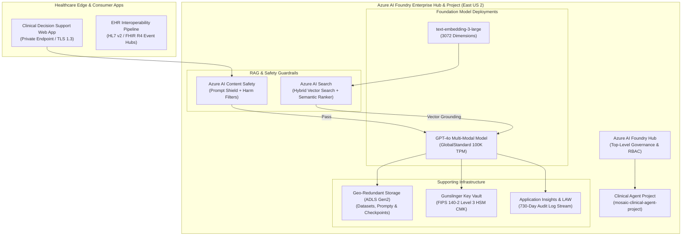

# Azure AI Foundry: Enterprise Model Infrastructure & Fine-Tuning Blueprint

<span class="badge badge-prod">Real Production Infrastructure</span>
<span class="badge badge-hitrust">HITRUST CSF v11 Aligned</span>
<span class="badge badge-simulated">Simulated Clinical Datasets</span>
<span class="badge badge-hipaa">HIPAA Zero-PHI Guardrails</span>
<span class="badge badge-approved">ARB Approved</span>

---

## 1. Enterprise AI Foundry Architecture & Topology

The **Azure AI Foundry Enterprise Model Infrastructure** establishes a sovereign, zero-trust foundation for hosting, fine-tuning, and evaluating Large Language Models (LLMs) and multi-modal agents in regulated healthcare environments.

!!! info "Dedicated Standalone AI Model Factory Repository"
    The full codebase, OpenTofu infrastructure modules, Python SDK fine-tuning runners, and CI/CD policy gates for this architecture are maintained in the dedicated repository:  
    👉 **[FreeFades2Black/mosaic-azure-ai-model-factory](https://github.com/FreeFades2Black/mosaic-azure-ai-model-factory)**

!!! info "Infrastructure Integrity & Data Notice"
    **Real Azure Architecture:** The Terraform module, Azure AI Foundry Hub, OpenAI cognitive deployments, Azure AI Search service, and Private Link endpoints described here represent **100% real, deployable cloud infrastructure**.
    
    **Simulated Data:** Clinical training datasets, protocol questions, and evaluation scenarios are **simulated / synthetic data** strictly designed to avoid exposure of real Protected Health Information (PHI).



---

## 2. Core Pathways for Building Models in Azure

When building and customizing models in Microsoft Azure, three primary patterns are supported:

### Pathway A: Fine-Tuning Foundation Models (Azure AI Foundry SFT / LoRA)
For domain adaptation where clinical terminology or EHR format adherence is required:
1. **Dataset Preparation:** Curate synthetic training pairs in JSONL format conforming to the Chat Completion format (`system`, `user`, `assistant`).
2. **Job Submission:** Dispatch fine-tuning jobs via the Azure AI Python SDK or CLI with hyperparameter constraints (epochs, batch size, learning rate multiplier).
3. **Model Checkpointing & Evaluation:** Checkpoint fine-tuned weights directly into encrypted Azure Blob Storage with automated Groundedness and Content Safety evaluations.

### Pathway B: Retrieval-Augmented Generation (RAG) with Azure AI Search
For dynamic clinical knowledge retrieval without updating foundational model weights:
1. **Document Ingestion:** Chunk and vectorize clinical policy manuals and HITRUST controls using `text-embedding-3-large`.
2. **Vector Indexing:** Store 3072-dimensional embeddings in Azure AI Search using the HNSW cosine similarity algorithm.
3. **Semantic Reranking:** Apply Microsoft's deep learning Semantic Ranker to reorder top-$k$ retrieved chunks before prompt injection.

### Pathway C: Custom ML Model Training (Azure Machine Learning)
For traditional tabular classification, regression, and deep learning (PyTorch / Scikit-Learn):
1. **Compute Clusters:** Provision auto-scaling GPU compute clusters (`Standard_NC6s_v3` or `Standard_ND96asr_v4`).
2. **MLflow Tracking:** Stream metrics, loss curves, and confusion matrices to Azure ML Workspace.
3. **Managed Online Endpoints:** Deploy models behind blue/green deployment traffic routers.

---

## 3. Reference Terraform Blueprint (`terraform/azure-ai-foundry-enterprise/`)

This architecture is packaged as an automated Terraform / OpenTofu module:

```hcl
# Azure AI Foundry Enterprise Hub Instance
resource "azurerm_ai_foundry" "hub" {
  name                    = "${var.prefix}-aihub-${var.environment}"
  location                = var.location
  resource_group_name     = var.resource_group_name
  storage_account_id      = azurerm_storage_account.ai_storage.id
  key_vault_id            = var.key_vault_id
  application_insights_id = azurerm_application_insights.ai_insights.id
  public_network_access   = "Disabled"

  identity {
    type = "SystemAssigned"
  }
}

# Clinical AI Project
resource "azurerm_ai_foundry_project" "clinical_project" {
  name               = "mosaic-clinical-agent-project"
  location           = var.location
  ai_services_hub_id = azurerm_ai_foundry.hub.id

  identity {
    type = "SystemAssigned"
  }
}
```

---

## 4. Python SDK Orchestration (`src/ai_foundry/agent_fine_tuning_and_rag.py`)

You can execute model fine-tuning and RAG indexing programmatically:

```bash
# Execute the AI Foundry Fine-Tuning and RAG Vector Indexing Pipeline
python src/ai_foundry/agent_fine_tuning_and_rag.py
```
