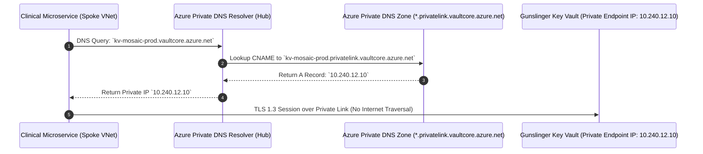

# Hybrid Networking & Azure Virtual WAN Backbone

<span class="badge badge-prod">Global Transit Backbone</span>
<span class="badge badge-hitrust">HITRUST Control 09.0</span>

---

## 1. Global Virtual WAN Secured Hub Topology

Mosaic Healthcare operates an active-active dual-region hybrid backbone anchored by **Azure Virtual WAN (vWAN)**. The topology interconnects 140+ ambulatory clinics, regional hospitals, remote physician networks, and multi-cloud landing zones with strict cryptographic isolation and micro-segmentation.

```mermaid
graph TB
    subgraph "On-Premises Healthcare Edge"
        HospitalEdge["Regional Medical Centers (x12)<br/>Dual 10Gbps ExpressRoute Direct with MACsec"]
        ClinicEdge["Ambulatory Care Clinics (x140)<br/>Dual Cisco Meraki / Fortinet SD-WAN IPsec"]
        MCOpsEdge["Multi-Cloud Ingress (AWS / GCP)<br/>Megaport Cloud Router / Site-to-Site IPsec"]
    end

    subgraph "Azure Primary Region: East US 2 (Hub-01)"
        vWANHub1["Azure Virtual WAN Secured Hub<br/><code>vwan-hub-eastus2</code> (10.200.0.0/20)"]
        AzFW1["Azure Firewall Premium<br/>(IDPS, TLS Inspection, FQDN Filtering)"]
        ERGW1["ExpressRoute Gateway (Scale Unit 4)<br/>ASN: 65010"]
        VPNGW1["VPN Gateway (Scale Unit 2)<br/>ASN: 65011"]
        DNSResolver1["Azure Private DNS Resolver<br/>Inbound & Outbound Endpoints"]
        
        vWANHub1 --> AzFW1
        vWANHub1 --> ERGW1
        vWANHub1 --> VPNGW1
        vWANHub1 --> DNSResolver1
    end

    subgraph "Azure Secondary Region: Central US (Hub-02 DR)"
        vWANHub2["Azure Virtual WAN Hub DR<br/><code>vwan-hub-centralus</code> (10.201.0.0/20)"]
        AzFW2["Azure Firewall Premium DR"]
        ERGW2["ExpressRoute Gateway DR"]
        VPNGW2["VPN Gateway DR"]
        
        vWANHub2 --> AzFW2
        vWANHub2 --> ERGW2
        vWANHub2 --> VPNGW2
    end

    subgraph "Spoke Virtual Networks"
        ClinicalSpoke["Spoke: Clinical Workloads<br/>(10.240.0.0/18)<br/>Epic, Cerner, FHIR Ingestion"]
        AnalyticsSpoke["Spoke: Databricks Lakehouse<br/>(10.240.64.0/18)<br/>Delta Lake, AI TimesFM Models"]
        ManagementSpoke["Spoke: Platform & SIEM<br/>(10.240.128.0/20)<br/>Sentinel, Bastion, AD DS"]
    end

    HospitalEdge ==>|Primary 10G ER Circuit| ERGW1
    HospitalEdge -.->|Secondary 10G ER Circuit| ERGW2
    ClinicEdge ==>|Active S2S IPsec| VPNGW1
    ClinicEdge -.->|Failover S2S IPsec| VPNGW2
    MCOpsEdge ==>|Multi-Cloud Transit| VPNGW1

    vWANHub1 <===>|Global vWAN Inter-Hub Peering| vWANHub2

    AzFW1 <==>|Secured Routing Intent (0.0.0.0/0 & RFC1918)| ClinicalSpoke
    AzFW1 <==>|Secured Routing Intent| AnalyticsSpoke
    AzFW1 <==>|Secured Routing Intent| ManagementSpoke
```

---

## 2. Enterprise IP Addressing Architecture (Non-Overlapping CIDR)

To eliminate routing collisions during rapid healthcare mergers and acquisitions (M&A), Mosaic enforces a strict global IPv4 allocation schema:

| Network Tier / Scope | CIDR Allocation | Description & Purpose |
| :--- | :--- | :--- |
| **Enterprise Virtual WAN Hub (East US 2)** | `10.200.0.0/20` | Core gateway infrastructure, Azure Firewall, GatewaySubnets |
| **Enterprise Virtual WAN Hub (Central US DR)** | `10.201.0.0/20` | Secondary failover gateway infrastructure |
| **Platform Management & Identity Spokes** | `10.240.128.0/20` | Entra ID Domain Services, Log Analytics, Sentinel Gateways |
| **Clinical Tier-1 EHR Spokes (Prod)** | `10.240.0.0/18` | Epic EHR web/app tiers, InterSystems HealthShare, FHIR APIs |
| **Lakehouse & Data Analytics Spokes** | `10.240.64.0/18` | Databricks control/data planes, TimesFM GPU inference nodes |
| **M&A Acquisition Transit Subnet (Quarantine)** | `10.245.0.0/20` | Isolated staging VPC for incoming acquired networks |
| **On-Premises Hospital Campuses (x12)** | `10.100.0.0/14` | High-acuity campus LANs, ICU telemetry, medical modalities |
| **Ambulatory & Regional Clinics (x140)** | `10.160.0.0/12` | Clinic LANs (allocated as `/24` per clinic site) |

---

## 3. Azure Firewall Premium Security Policies

The centralized Azure Firewall Premium in the Secured Virtual Hub inspects all East-West (Spoke-to-Spoke) and North-South (EHR-to-OnPrem / Internet) traffic:

```mermaid
flowchart LR
    Ingress[Inbound Traffic from Clinic / Spoke] --> SNI[TLS 1.3 SNI Header Inspection]
    SNI --> IDPS[Signature-based IDPS Engine<br/>(67,000+ Healthcare Threat Rules)]
    IDPS --> FQDN[Application Rule Engine<br/>(FQDN & Web Category Filtering)]
    FQDN -->|Allowed| Dest[Destination Private Endpoint / Spoke]
    FQDN -->|Blocked / Malicious| Drop[Automated Drop & Sentinel Alert Incident]
```

### Key Firewall Rule Collections

1. **Clinical Ingestion (HL7 / FHIR):**
   - Source: Clinic Edge CIDRs (`10.160.0.0/12`)
   - Destination: Clinical Ingestion Private Endpoints (`10.240.10.50`, `10.240.10.51`)
   - Protocols/Ports: `TCP/443` (HTTPS FHIR R4), `TCP/2575` (MLLP over TLS 1.3 for HL7 v2)
   - Action: `Allow` with IDPS Alert & Deny mode.

2. **Outbound Internet Lockdown (Zero Trust):**
   - Source: All Production Spokes (`10.240.0.0/16`)
   - Destination: `*.epic.com`, `*.cerner.com`, `*.microsoft.com`, `login.microsoftonline.com`
   - Protocols: `HTTPS` on port 443 only. All other outbound destinations denied by default.

---

## 4. Split-Horizon Private DNS Architecture

Private Endpoints allow microservices, Lakehouses, and clinical APIs to communicate over private IPs without traversing the public internet.


