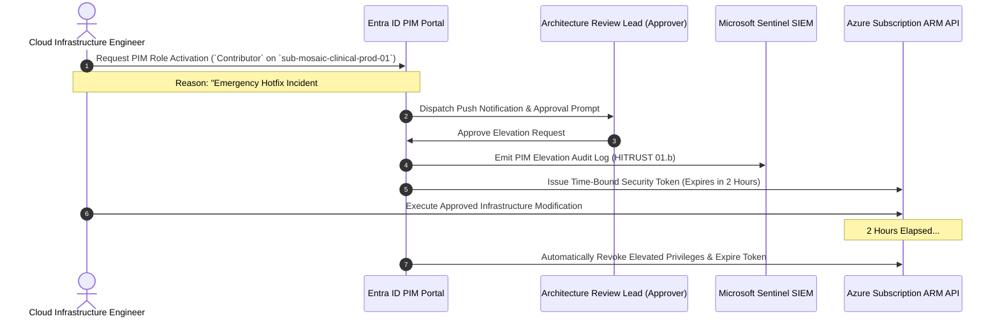

# Identity, Entra ID & Privileged Access Management

<span class="badge badge-prod">Zero-Trust Identity</span>
<span class="badge badge-hitrust">HITRUST Control 01.0 / 02.0</span>

---

## 1. Zero-Trust Identity Architecture

Identity is the primary security boundary in modern healthcare cloud architectures. The Mosaic Healthcare identity plane integrates on-premises Active Directory forests across 140+ clinics into a centralized **Microsoft Entra ID (Azure AD)** tenant, enforcing phishing-resistant authentication and automated credential lifecycle governance.

```mermaid
graph TD
    subgraph "On-Premises AD DS Forests"
        CorpAD["Corporate Active Directory Forest<br/>ad.mosaic-healthcare.org"]
        AcquiredAD["Acquired Hospital Forest<br/>legacy.carolina-health.local"]
    end

    subgraph "Entra ID Cloud Identity Plane"
        EntraCloudSync["Microsoft Entra Cloud Sync Agents<br/>(Lightweight, High-Availability)"]
        EntraTenant["Entra ID Enterprise Tenant<br/>mosaic-healthcare.onmicrosoft.com"]
        CAEngine["Conditional Access Engine<br/>(Device Compliance, Risk Level, Location)"]
        PIMService["Entra ID Privileged Identity Management (PIM)<br/>(JIT Elevation, ARB Approval, MFA Step-Up)"]
    end

    subgraph "Target Cloud Workloads & APIs"
        AzurePortal["Azure Resource Manager / Portal"]
        LakehouseUC["Databricks Unity Catalog"]
        ClinicalApp["Epic EHR / FHIR Microservices"]
    end

    CorpAD -->|Hash Sync + SSPR| EntraCloudSync
    AcquiredAD -->|Cloud Sync Staging| EntraCloudSync
    EntraCloudSync --> EntraTenant

    EntraTenant --> CAEngine
    CAEngine --> PIMService

    PIMService -->|Time-Bound RBAC Token (Max 4h)| AzurePortal
    PIMService -->|SCIM Identity Federation| LakehouseUC
    PIMService -->|OIDC / OAuth2 Bearer Token| ClinicalApp
```

---

## 2. Conditional Access Enforcement Policies

Every authentication request evaluated by Entra ID must satisfy mandatory conditional access control gates before token issuance:

| Policy Name | Target Users / Scope | Conditions & Grant Controls | Enforcement Action |
| :--- | :--- | :--- | :--- |
| **CA-001: Mandatory FIDO2 / WHfB for Privileged Roles** | Global Admins, Security Admins, Cloud Engineers | Any Network Location, Any Device | Require Phishing-Resistant MFA (FIDO2 or Windows Hello for Business). Block SMS/Voice OTP. |
| **CA-002: Clinical Workload Device Compliance** | Clinicians, Nurses, Informatics Staff | Accessing EHR / PHI data portals | Require Microsoft Intune Compliant Device & BitLocker active encryption. |
| **CA-003: Risk-Based Step-Up Authentication** | All Active Identities | Sign-in Risk: Medium or High (Entra ID Protection) | Prompt for MFA step-up + Password reset if High Risk detected. |
| **CA-004: Block Legacy Basic Authentication** | 100% of Tenant Identities | Exchange ActiveSync, POP3, IMAP4, Legacy MAPI | Explicit `Block Access`. |
| **CA-005: Location-Based Strict Ingress** | Database & Key Vault Administrators | Outside US/Canada Geolocation | Explicit `Block Access` (Data residency enforcement). |

---

## 3. Privileged Identity Management (PIM) Lifecycle

Permanent standing administrative privileges (such as `Owner` or `User Access Administrator`) are strictly prohibited in the Mosaic production environment.



---

## 4. Role-Based Access Control (RBAC) Matrix

To enforce the principle of least privilege, specific custom and built-in RBAC roles are scoped strictly at the appropriate Management Group or Subscription tier:

```
+------------------------------------+------------------------------------+------------------------------------+
| RBAC Role                          | Scope Tier                         | Permissions & Capabilities         |
+------------------------------------+------------------------------------+------------------------------------+
| Management Group Contributor       | mg-mosaic-platform                 | Manage policy assignments and MG   |
|                                    |                                    | hierarchy; cannot alter PHI.       |
|                                    |                                    |                                    |
| Key Vault Crypto Officer           | Key Vault Resource Level           | Generate, rotate, and manage CMK   |
|                                    |                                    | encryption keys; no data access.   |
|                                    |                                    |                                    |
| Clinical Data Reader (PHI)         | Clinical Workload Storage/DB       | Read access to de-identified/live  |
|                                    |                                    | FHIR stores with query auditing.   |
|                                    |                                    |                                    |
| Network Infrastructure Operator    | sub-mosaic-conn-prod-01            | Modify vWAN routing, Azure FW      |
|                                    |                                    | rules, and ExpressRoute links.     |
+------------------------------------+------------------------------------+------------------------------------+
```
