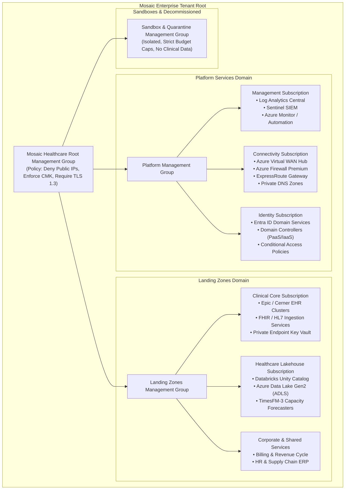

# Azure Landing Zone & Hybrid Backbone Architecture

Enterprise Landing Zone
HITRUST CSF v11

---

## Strategic Blueprint Overview

The **Mosaic Healthcare Azure Landing Zone** is architected in alignment with the **Microsoft Cloud Adoption Framework (CAF)** and custom tailored for high-acuity healthcare workloads, HIPAA compliance, and multi-facility operational resilience.

The architecture enforces strict operational separation across **Management**, **Connectivity**, **Identity**, and **Workload** domains, ensuring that compromised developer credentials or experimental sandbox failures cannot penetrate clinical environments containing Protected Health Information (PHI).

---

## Core Landing Zone Sub-Sections

- **[Management Group Hierarchy & Policy Governance](management-groups.md)**  
  Detailed taxonomy of management groups, hierarchical subscription placement, Azure Policy initiatives, and automated guardrails enforcing HITRUST CSF standards.
- **[Hybrid Networking & Virtual WAN Backbone](hybrid-networking.md)**  
  Virtual WAN architecture, Secured Hub design with Azure Firewall Premium, ExpressRoute 10Gbps circuits, dual IPsec VPN fallback, and zero-trust private link endpoints.
- **[Identity, Entra ID & Privileged Access Management](identity-access.md)**  
  Hybrid identity synchronization, phishing-resistant FIDO2 MFA, Just-in-Time (JIT) Privileged Identity Management (PIM), and role-based access control (RBAC) tiers.
