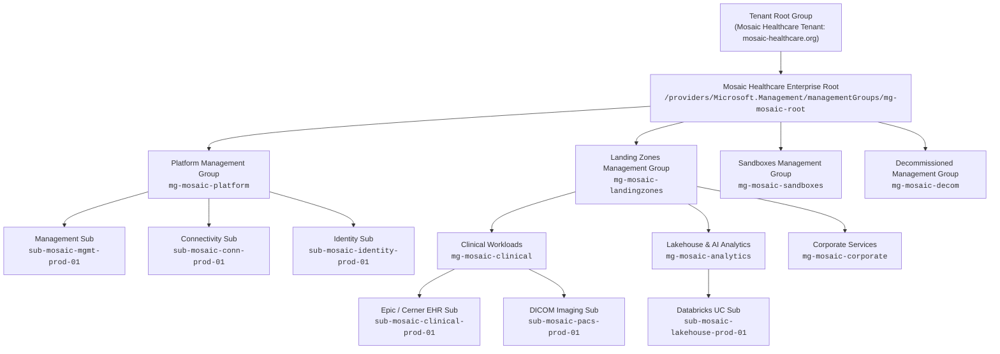
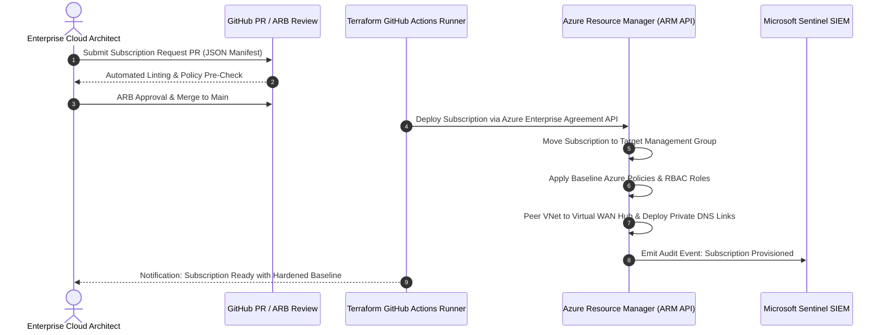

# Enterprise Management Group Hierarchy & Governance

<span class="badge badge-prod">Governance Hierarchy</span>
<span class="badge badge-hitrust">HITRUST Control 01.0</span>

---

## 1. Hierarchy Design & Subscription Taxonomy

In an enterprise healthcare organization operating over 140+ clinics and medical centers, governance must be structured to prevent configuration drift, enforce strict regulatory controls at the root, and grant autonomous velocity to engineering squads within pre-approved boundary constraints.



---

## 2. Management Group Guardrails & Azure Policy Initiatives

Each node in the hierarchy applies specific **Azure Policy Initiatives (Policy Sets)** enforcing zero-trust constraints:

### Root Level Policy Guardrails (`mg-mosaic-root`)

| Policy Definition / Initiative | Effect | Rationale & HITRUST Mapping |
| :--- | :--- | :--- |
| **Require Secure Transfer & TLS 1.3** | `Deny` | Prohibits unencrypted HTTP and TLS < 1.3 for all Azure Storage, App Services, and API Gateways (HITRUST 09.0). |
| **Deny Public Network Access on Data Stores** | `Deny` | Enforces Private Endpoints for all Key Vaults, SQL Databases, Cosmos DB, and Storage Accounts. |
| **Enforce Customer-Managed Keys (CMK)** | `Deny` | Requires all block/blob storage and managed disks to utilize CMK hosted in FIPS 140-2 Level 3 Key Vaults. |
| **Restrict Approved Azure Regions** | `Deny` | Limits provisioning strictly to `East US 2` (Primary) and `Central US` (Secondary DR) to satisfy geographic data residency. |
| **Require Mandatory Governance Resource Tags** | `Deny` | Enforces `Environment`, `Owner`, `CostCenter`, `DataClassification` (`PHI`, `Confidential`, `Public`), and `ComplianceScope`. |

### Platform Level Policy Guardrails (`mg-mosaic-platform`)

- **Diagnostic Setting Centralization:** Automatically assigns diagnostic settings via `DeployIfNotExists` sending all platform resource logs to the primary Log Analytics Workspace in `sub-mosaic-mgmt-prod-01`.
- **RBAC Role Assignment Lockdown:** Restricts owner permissions to PIM-activated security groups. Prevents manual service principal secret creation without secret lifecycle governance.

### Landing Zone Clinical Guardrails (`mg-mosaic-clinical`)

- **Subnet NSG Enforcement:** Enforces Network Security Groups on 100% of subnets.
- **Bastion / Jump Host Prohibition:** Prohibits direct RDP (3389) and SSH (22) from non-bastion IP space.
- **HIPAA CSF Benchmark:** Automatically applies the **Azure Security Benchmark v3** and **HITRUST CSF v11.0** compliance initiatives with real-time continuous evaluation.

---

## 3. Automated Subscription Vending Machine

To support rapid M&A integration and internal squad provisioning, Mosaic Healthcare utilizes a **Subscription Vending Machine (SVM)** pipeline driven by Terraform and GitHub Actions:



### Subscription Baseline Manifest Example

```json
{
  "$schema": "https://schema.management.azure.com/schemas/2019-04-01/deploymentTemplate.json#",
  "subscriptionName": "sub-mosaic-clinical-oncology-prod-01",
  "targetManagementGroup": "mg-mosaic-clinical",
  "primaryRegion": "eastus2",
  "secondaryRegion": "centralus",
  "costCenter": "CC-94102-CLINICAL-ONCOLOGY",
  "dataClassification": "PHI",
  "vnetCidrPrimary": "10.240.16.0/20",
  "vnetCidrSecondary": "10.241.16.0/20"
}
```
