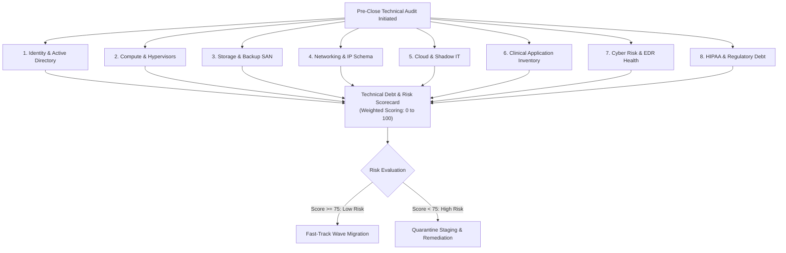

# M&A Technical Due Diligence Checklist

<span class="badge badge-prod">Technical Due Diligence</span>
<span class="badge badge-hitrust">Risk Assessment</span>

---

## 1. Due Diligence Audit Framework Overview

Prior to executing any network interconnection or identity federation with an acquired healthcare entity, the Enterprise Architecture Review Board (ARB) conducts an exhaustive 8-pillar discovery audit. This process evaluates cybersecurity posture, identifies technical debt, assesses HIPAA/HITRUST compliance gaps, and scopes migration complexity.



---

## 2. Exhaustive 8-Pillar Discovery Matrix

### Pillar 1: Identity & Active Directory Topology

| Discovery Question / Metric | Inspection Method | Red Flag / Blocker Condition |
| :--- | :--- | :--- |
| **Forest Functional Level (FFL)** | `Get-ADForest` PowerShell audit | Windows Server 2008 R2 or older (Unsupported kerberos encryption). |
| **Domain Trusts & Federation** | Active Directory Domains and Trusts | Unconstrained delegation or one-way external trusts to unvetted partners. |
| **Privileged Group Population** | Enumerate `Domain Admins`, `Enterprise Admins` | Over 5 members in Domain Admins or accounts without mandatory MFA. |
| **Stale Accounts & Passwords** | Accounts inactive > 90 days | > 20% stale identities; passwords set to never expire on service accounts. |

### Pillar 2: Compute & Hypervisors

| Discovery Question / Metric | Inspection Method | Red Flag / Blocker Condition |
| :--- | :--- | :--- |
| **Hypervisor Distribution** | VMware vSphere 7.x/8.x, Hyper-V, Nutanix AHV | End-of-Life ESXi 6.0/6.5 hosts with known hypervisor breakout vulnerabilities. |
| **Operating System Breakdown** | RVTools / Azure Migrate automated appliance | Windows Server 2003/2008 or RHEL 5/6 without extended security updates. |
| **CPU / RAM Overcommit Ratio** | VMware vCenter performance metrics | vCPU to pCPU ratio > 4:1 on high-tier database hosts. |

### Pillar 3: Storage & Backup SAN

| Discovery Question / Metric | Inspection Method | Red Flag / Blocker Condition |
| :--- | :--- | :--- |
| **SAN Storage Arrays** | Pure Storage, NetApp, Dell EMC Unity/PowerStore | Unencrypted LUNs containing patient record stores. |
| **Backup Immutability** | Veeam / Commvault backup target inspection | Lack of air-gapped / immutable S3 Object Lock backup copies. |
| **RPO / RTO Verification** | Historical disaster recovery drill logs | RPO exceeding 4 hours for Tier-1 clinical databases. |

### Pillar 4: Networking & IP Address Space

| Discovery Question / Metric | Inspection Method | Red Flag / Blocker Condition |
| :--- | :--- | :--- |
| **RFC 1918 Overlap** | IPAM inspection against Mosaic Master IPAM | Overlap with `10.200.0.0/16` or `10.240.0.0/16` (Requires 1:1 NAT Gateway). |
| **WAN Circuits & ISP Redundancy** | BGP peer tables & telecom contracts | Single homed T1/Coax lines without secondary fiber failover for clinical sites. |
| **Legacy VPN Hardening** | Firewall configuration export | Deprecated IKEv1 or 3DES/MD5 encryption suites on Site-to-Site tunnels. |

### Pillar 5: Cloud & Shadow IT Ingress

| Discovery Question / Metric | Inspection Method | Red Flag / Blocker Condition |
| :--- | :--- | :--- |
| **Public Cloud Accounts** | AWS Organizations, Azure Tenants, GCP Orgs | Unmonitored root/owner accounts without MFA or billing anomaly alerts. |
| **Shadow SaaS Subscriptions** | CASB / Defender for Cloud Apps discovery | Clinical data exported to unapproved cloud storage (Dropbox, Box personal). |

### Pillar 6: Clinical Application Inventory

| Discovery Question / Metric | Inspection Method | Red Flag / Blocker Condition |
| :--- | :--- | :--- |
| **Core EHR Engine** | Epic, Cerner Millennium, MEDITECH, Allscripts | Hardcoded database connection strings or unpatched DICOM PACS modalities. |
| **HL7 Interface Engines** | Mirth Connect, Corepoint, Cloverleaf | Unencrypted MLLP interfaces across public WAN without VPN encapsulation. |

### Pillar 7: Cyber Risk & Threat Posture

| Discovery Question / Metric | Inspection Method | Red Flag / Blocker Condition |
| :--- | :--- | :--- |
| **EDR Coverage** | CrowdStrike Falcon, Microsoft Defender for Endpoint | < 95% endpoint sensor deployment across workstations and servers. |
| **Active IOC Presence** | Threat hunting script execution across memory | Indicators of Compromise (Cobalt Strike, Mimikatz, active C2 beacons). |

### Pillar 8: HIPAA & Regulatory Compliance Debt

| Discovery Question / Metric | Inspection Method | Red Flag / Blocker Condition |
| :--- | :--- | :--- |
| **Business Associate Agreements (BAAs)**| Legal contract repository review | Missing signed BAAs for third-party hosting providers holding PHI. |
| **OCR Settlement / Audit Findings** | Historical compliance disclosures | Open Corrective Action Plans (CAP) with the Office for Civil Rights. |

---

## 3. Technical Debt Scorecard Calculator

```
+------------------------------------+----------------+----------------+--------------------+
| Audit Category                     | Maximum Points | Passing Score  | Risk Level Threshold|
+------------------------------------+----------------+----------------+--------------------+
| Identity & Access Security         | 20             | >= 16          | < 12 = HIGH RISK   |
| Compute & Hypervisor Health        | 15             | >= 12          | < 9  = MED RISK    |
| Storage & Backup Immutability      | 15             | >= 12          | < 9  = HIGH RISK   |
| Network Isolation & IP Cleanliness | 15             | >= 12          | < 8  = CRITICAL    |
| Cyber Hygiene & EDR Deployment     | 20             | >= 18          | < 15 = CRITICAL    |
| HIPAA Regulatory Governance        | 15             | >= 13          | < 10 = HIGH RISK   |
+------------------------------------+----------------+----------------+--------------------+
| TOTAL SCORE                        | 100            | >= 83          | < 70 = QUARANTINE  |
+------------------------------------+----------------+----------------+--------------------+
```
