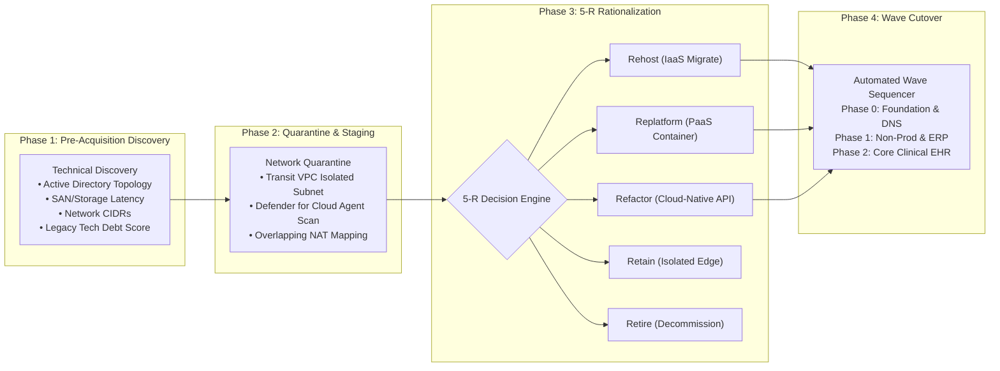

# M&A Due Diligence & Workload Migration Engine

M&A Playbook
Enterprise Migration

---

## 1. Mergers & Acquisitions Strategic Framework

Healthcare systems scale rapidly through regional hospital acquisitions and joint venture partnerships. Integrating disparate legacy infrastructure into the Mosaic Azure Landing Zone within aggressive 90-day timeframes requires a standardized, repeatable engineering engine.

The **Mosaic M&A Workload Migration Engine** bridges the gap between pre-close technical due diligence, cyber risk quarantine, 5-R workload rationalization, and zero-downtime clinical EHR cutovers.

---

## 2. Core Playbook Components

- **[Due Diligence Technical Checklist](due-diligence-checklist.md)**  
  Comprehensive 8-pillar technical audit framework assessing Active Directory domain functional levels, virtualization hypervisors (VMware ESXi / Hyper-V), SAN storage throughput, public cloud assets, and regulatory compliance liabilities.
- **[Wave Migration Sequencer & Rollback Triggers](wave-migration-sequencer.md)**  
  Step-by-step cutover orchestration model outlining dependency grouping, wave scheduling, real-time database replication synchronization, pre-flight gate criteria, and automated rollback triggers.
