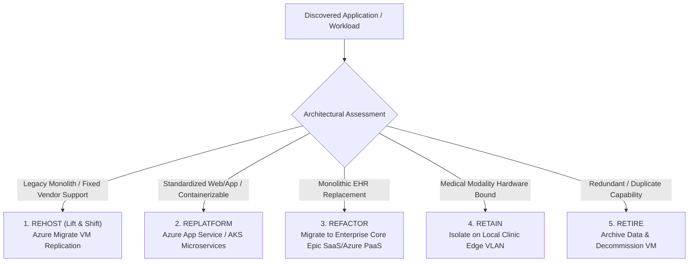
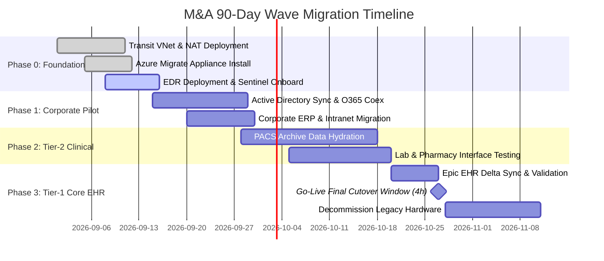
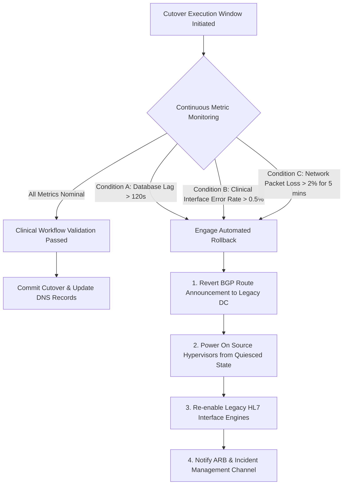

# Wave Migration Sequencer & Rollback Triggers

<span class="badge badge-prod">Migration Sequencer</span>
<span class="badge badge-hitrust">High-Acuity Resilience</span>

---

## 1. 5-R Workload Rationalization Engine

When an acquisition is finalized, every discovered server, database, and clinical microservice is classified into one of five rationalization buckets:



---

## 2. 4-Phase Wave Execution Sequencer

Workloads migrate in structured waves to eliminate blast radius and ensure emergency department and ICU clinical operations remain uninterrupted.



### Phase Details

1. **Phase 0: Foundation & Network Quarantine (Days 1–15)**
   - Deploy Transit VNet (`10.245.0.0/20`) with Azure Firewall inspection.
   - Establish Site-to-Site IPsec VPN to acquired datacenter.
   - Deploy Azure Migrate Hyper-V / VMware virtual appliance.
   - Install CrowdStrike / Defender for Endpoint agents on all endpoints.

2. **Phase 1: Pilot & Corporate Systems (Days 16–30)**
   - Synchronize Entra ID identities via Entra Cloud Sync.
   - Migrate file servers, payroll ERP, and internal intranet portals.
   - Verify identity federation and Conditional Access enforcement.

3. **Phase 2: Tier-2 Clinical Supporting Systems (Days 31–60)**
   - Pre-seed secondary PACS imaging archives (DICOM studies > 2 years old) to Azure Blob Storage (Cold Tier).
   - Replatform Lab Information Systems (LIS) and Pharmacy dispensing interfaces to containerized AKS clusters.

4. **Phase 3: Tier-1 EHR Core Cutover (Days 61–90)**
   - Initialize continuous database block-level replication (Azure Site Recovery / Always On Availability Groups).
   - Execute scheduled 4-hour weekend cutover window during low clinical census.

---

## 3. Pre-Flight Go/No-Go Gate Criteria

Prior to commencing any final production cutover, all six pre-flight criteria must be certified by the Incident Commander:

```
[ ] 1. Data Replication Lag: < 1.0 seconds across all database replicas.
[ ] 2. Identity Verification: 100% of clinicians authenticated successfully via Entra ID MFA.
[ ] 3. Network Latency: Round-trip time (RTT) from clinic edge to Azure Virtual WAN Hub < 18ms.
[ ] 4. Rollback Snapshots: Immutable SAN snapshot and Azure backup verified.
[ ] 5. ARB Sign-Off: Lead Clinical Informaticist and CISO formal sign-off recorded.
[ ] 6. Help Desk Preparedness: Dedicated high-priority triage queue active with 24/7 staffing.
```

---

## 4. Automated Rollback Triggers & Runbook

If any critical failure threshold is exceeded during the cutover window, the automated rollback trigger is engaged:



### Rollback Metric Thresholds

| Trigger Code | Metric Monitored | Critical Threshold | Automated Action |
| :--- | :--- | :--- | :--- |
| **TRG-01** | Database Replication Lag | > 120 seconds for > 3 minutes | Halt cutover; failback to primary on-prem cluster. |
| **TRG-02** | HL7 Interface Message Drops | > 10 unacknowledged messages | Revert MLLP DNS routes to on-prem interface engine. |
| **TRG-03** | End-to-End Synthetic Latency | RTT > 45ms for > 5 minutes | Re-route clinical traffic via backup MPLS circuit. |
| **TRG-04** | Clinician Login Failure Rate | > 2.0% failed authentications | Re-enable legacy AD federation endpoint temporarily. |
