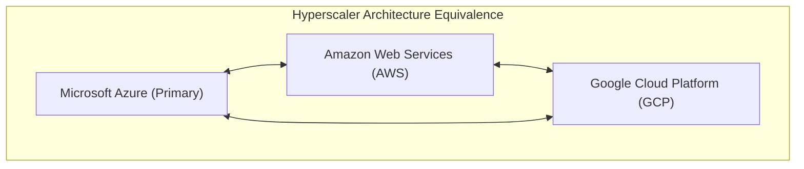

# Multi-Cloud Rosetta Stone: AWS vs GCP vs Azure

Cross-Cloud Matrix
Enterprise Parity

---

## 1. Executive Cross-Cloud Translation Ledger

This matrix establishes technical equivalents across the three major hyperscale cloud providers, enabling cross-functional engineering teams to maintain consistent governance, security architectures, and operational runbooks.

---

## 2. Comprehensive Service Comparison Matrix

| Architectural Domain | Microsoft Azure (Primary) | Amazon Web Services (AWS) | Google Cloud Platform (GCP) | Enterprise Parity Notes |
| :--- | :--- | :--- | :--- | :--- |
| **1. Identity & Access (IAM)** | **Microsoft Entra ID (Azure AD)** + PIM + Conditional Access | **AWS IAM Identity Center (SSO)** + IAM Roles + SCPs | **Google Cloud Identity** + IAM Workload Identity + BeyondCorp | Entra ID serves as the master identity provider; AWS/GCP federate via SAML 2.0 / OIDC. |
| **2. Hierarchy & Governance** | Management Groups &rarr; Subscriptions &rarr; Resource Groups | AWS Organizations &rarr; OUs &rarr; AWS Accounts | GCP Organization &rarr; Folders &rarr; Projects | Azure Management Groups map directly to AWS OUs and GCP Folders for policy inheritance. |
| **3. Policy-as-Code** | **Azure Policy** (JSON ARM Schema / Rego via Gatekeeper) | **AWS Service Control Policies (SCPs)** + AWS Config | **GCP Organization Policy Service** + Forseti Security | Azure Policy applies at MG root level with automated `Deny` and `DeployIfNotExists`. |
| **4. Global Transit Network** | **Azure Virtual WAN** (Secured Hub with Routing Intent) | **AWS Transit Gateway (TGW)** + Cloud WAN | **GCP Network Connectivity Center (NCC)** + Cloud Router | vWAN Secured Hub provides unified automated routing table orchestration. |
| **5. Network Perimeter Firewall** | **Azure Firewall Premium** (IDPS, TLS Inspection, FQDN) | **AWS Network Firewall** (Suricata IDPS Engine) | **GCP Cloud Next Generation Firewall (NGFW)** | IDPS signature rules synchronized to detect healthcare malware across all providers. |
| **6. Private Connectivity** | **Azure Private Link / Private Endpoints** | **AWS PrivateLink / VPC Interface Endpoints** | **GCP Private Service Connect (PSC)** | Eliminates public IP transit for all managed PaaS databases and key vaults. |
| **7. Dedicated Hybrid Circuit** | **Azure ExpressRoute** (10Gbps Direct + MACsec) | **AWS Direct Connect (DX)** (10Gbps + MACsec) | **GCP Cloud Interconnect** (Dedicated 10Gbps) | Dual redundant circuits deployed to meet 99.999% high-availability SLA. |
| **8. Key Management & Cryptography** | **Azure Key Vault Premium** (FIPS 140-2 L3 HSM CMK) | **AWS KMS / CloudHSM** (Multi-Region CMK) | **GCP Cloud KMS / Cloud HSM** (EKM & Autokey) | RSA-4096 / AES-256 keys rotated automatically every 365 days. |
| **9. Object & Lakehouse Storage** | **Azure Data Lake Storage Gen2 (ADLS)** + Unity Catalog | **Amazon S3** + AWS Lake Formation + S3 Object Lock | **Google Cloud Storage (GCS)** + BigLake + Bucket Lock | WORM immutability policies enforced on all clinical archive buckets for 7 years. |
| **10. Container Orchestration** | **Azure Kubernetes Service (AKS)** (Entra Workload ID) | **Amazon Elastic Kubernetes Service (EKS)** (IRSA) | **Google Kubernetes Engine (GKE)** (Workload Identity) | Standardized multi-stage OCI containers running hardened non-root distroless images. |
| **11. Distributed Event Streaming** | **Azure Event Hubs** (Kafka API compatible) | **Amazon Kinesis Data Streams / MSK** | **Google Cloud Pub/Sub** | Ingests streaming HL7 v2 and FHIR telemetry at > 50,000 events/second. |
| **12. Relational & Document DB** | **Azure Cosmos DB** + **Azure Database for PostgreSQL Flexible** | **Amazon DynamoDB** + **Amazon Aurora PostgreSQL** | **Google Cloud Spanner** + **Cloud SQL PostgreSQL** | Multi-region active-active replication with sub-10ms read latencies. |
| **13. SIEM & Threat Detection** | **Microsoft Sentinel** + Microsoft Defender for Cloud | **Amazon GuardDuty** + AWS Security Hub + Security Lake | **Google Chronicle SIEM** + Security Command Center (SCC) | Sentinel ingests AWS CloudTrail and GCP Audit logs for single-pane SOC visibility. |
| **14. Infrastructure as Code (IaC)** | **Terraform (`hashicorp/azurerm`)** / Azure Bicep | **Terraform (`hashicorp/aws`)** / AWS CDK | **Terraform (`hashicorp/google`)** / GCP Config Connector | All infrastructure strictly declared in declarative Terraform HCL with CI/CD automation. |
