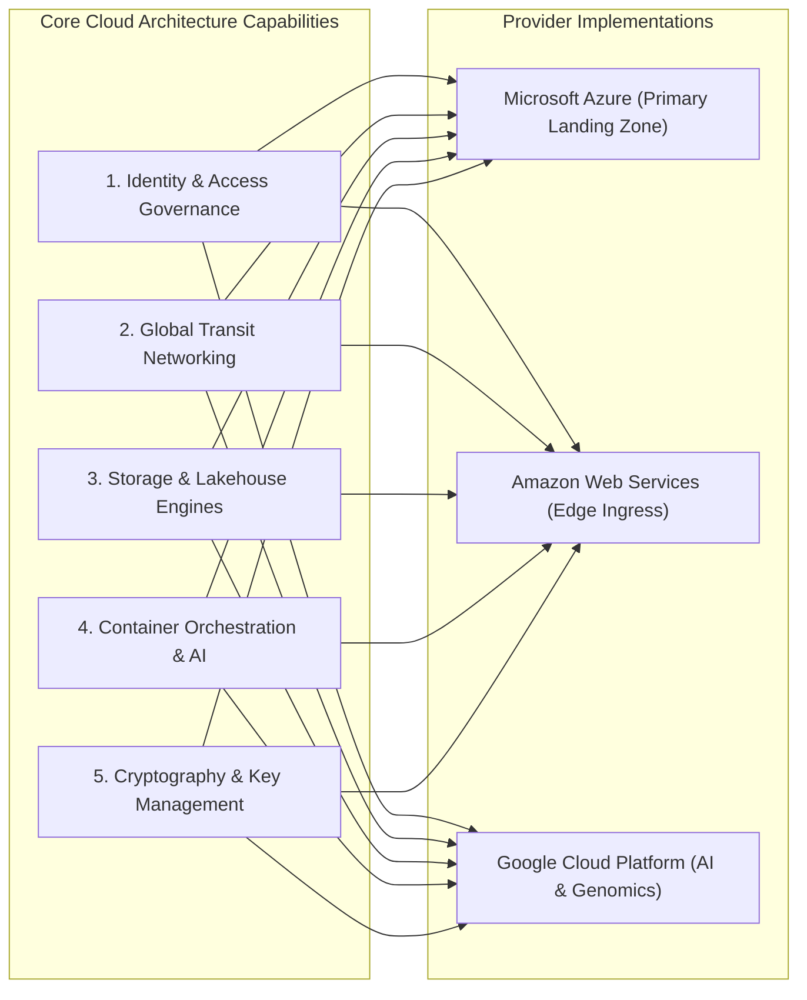

# Multi-Cloud Rosetta Stone & Cross-Cloud Architecture

Multi-Cloud Parity
Enterprise Standards

---

## 1. Cross-Cloud Strategy & Architectural Parity

While Azure serves as the primary clinical foundation and landing zone for Mosaic Healthcare, enterprise mergers, academic research partnerships, and AI initiatives frequently interact with **Amazon Web Services (AWS)** and **Google Cloud Platform (GCP)**.

The **Multi-Cloud Rosetta Stone** provides cloud architects and engineering teams with an unambiguous translation matrix across cloud primitives, identity models, network gateways, container engines, and encryption frameworks.

---

## 2. Core Rosetta Stone Modules

- **[AWS vs GCP vs Azure Service Mapping Matrix](aws-gcp-azure-mapping.md)**  
  Exhaustive functional and technical comparison across compute, storage, networking, security, IAM, databases, analytics, and operational monitoring.
- **[Cross-Cloud Workload Migration & Rationalization Framework](migration-rationalization.md)**  
  Decision framework for determining whether an acquired workload in AWS/GCP should be migrated to Azure or retained multi-cloud based on egress costs, clinical latency SLOs, and licensing.
