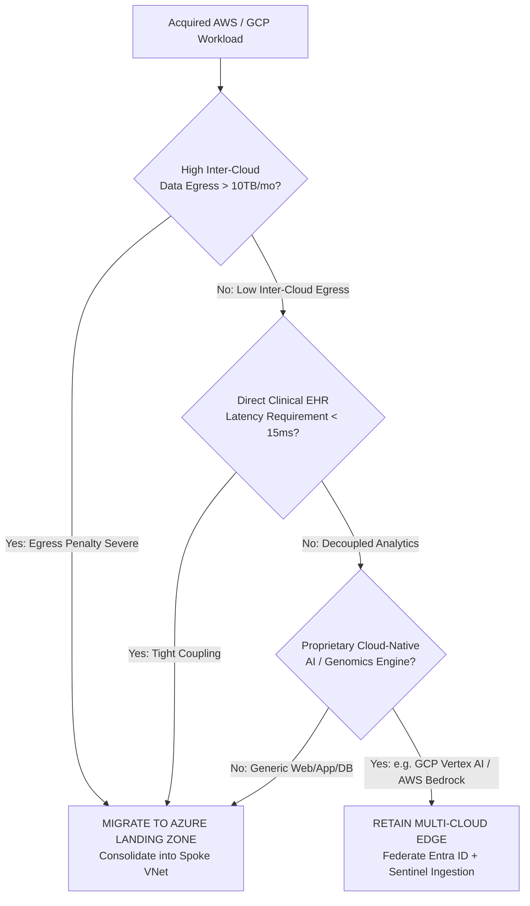

# Multi-Cloud Workload Migration & Rationalization Framework

Workload Rationalization
Economic & Architectural Governance

---

## 1. Migration vs Multi-Cloud Retention Decision Framework

When Mosaic Healthcare acquires an organization operating workloads in AWS or GCP, the Architecture Review Board (ARB) evaluates whether to **Migrate into the Azure Landing Zone** or **Retain Multi-Cloud with Federated Governance**.

---

## 2. Four Evaluation Pillars

### 1. Data Egress Economics & TCO
- **Egress Penalty Threshold:** Workloads exporting > 5TB of medical imaging or telemetry per month across cloud boundaries incur severe bandwidth fees ($0.02 - $0.09/GB). Consolidating into Azure reduces cross-cloud transit costs to zero.
- **Enterprise Agreement (EA) Pricing:** Mosaic leverages Azure EA enterprise discount tiers that typically yield 18–25% savings over uncommitted AWS/GCP retail rates.

### 2. Clinical Latency SLOs
- **Tier-1 In-Hospital Clinical Systems:** Must achieve < 15ms RTT from hospital bedside terminals to application backend. If the primary EHR (Epic/Cerner) resides in Azure East US 2, colocating supporting clinical engines in Azure is mandatory.
- **Asynchronous Batch Analytics:** Medical research, population health, and retrospective clinical trials have relaxed SLOs (hours/days) and can remain in AWS/GCP if specialized tooling warrants.

### 3. Specialty Capabilities & AI IP
- If an acquired research institute has developed proprietary deep learning models utilizing **Google Cloud BigQuery ML** or **AWS Sagemaker / Bedrock**, forced migration may disrupt clinical researchers. In such scenarios, the workload is retained with Azure Entra ID federation and Sentinel monitoring.

### 4. Operational Overhead & Security Surface Area
- Managing three distinct cloud IAM engines, firewall policies, and compliance auditing pipelines increases cyber risk surface area. Workloads are migrated to Azure by default unless an explicit ARB architectural exception is granted.

---

## 3. Workload Rationalization Action Matrix

| Acquired Workload Category | Source Cloud | Recommended Action | Justification & Architecture Pattern |
| :--- | :--- | :--- | :--- |
| **DICOM PACS Medical Imaging Archive** | AWS S3 | **Migrate to Azure ADLS Gen2** | High ingress/egress integration with clinical workstations; leverages Azure Blob Cold Tier with CMK encryption. |
| **Genomics Sequence Analysis Pipeline** | GCP Cloud Life Sciences / GCS | **Retain in GCP (Federated)** | Retains specialized Google Genomics pipeline; federates via GCP Workload Identity Federation with Entra ID. |
| **Enterprise Data Warehouse / BI** | AWS Redshift | **Migrate to Databricks on Azure** | Consolidates into Mosaic Healthcare Databricks Unity Catalog Lakehouse; eliminates dual BI licensing. |
| **Public Patient Appointment Portal** | AWS ECS / CloudFront | **Replatform to Azure Container Apps** | Unifies public WAF management under Azure Front Door Premium; standardizes CI/CD pipelines. |
| **Legacy Windows SQL Server Farm** | AWS EC2 / EBS | **Migrate to Azure SQL Managed Instance** | Azure Hybrid Benefit (AHB) reduces SQL and Windows Server licensing costs by up to 40%. |
