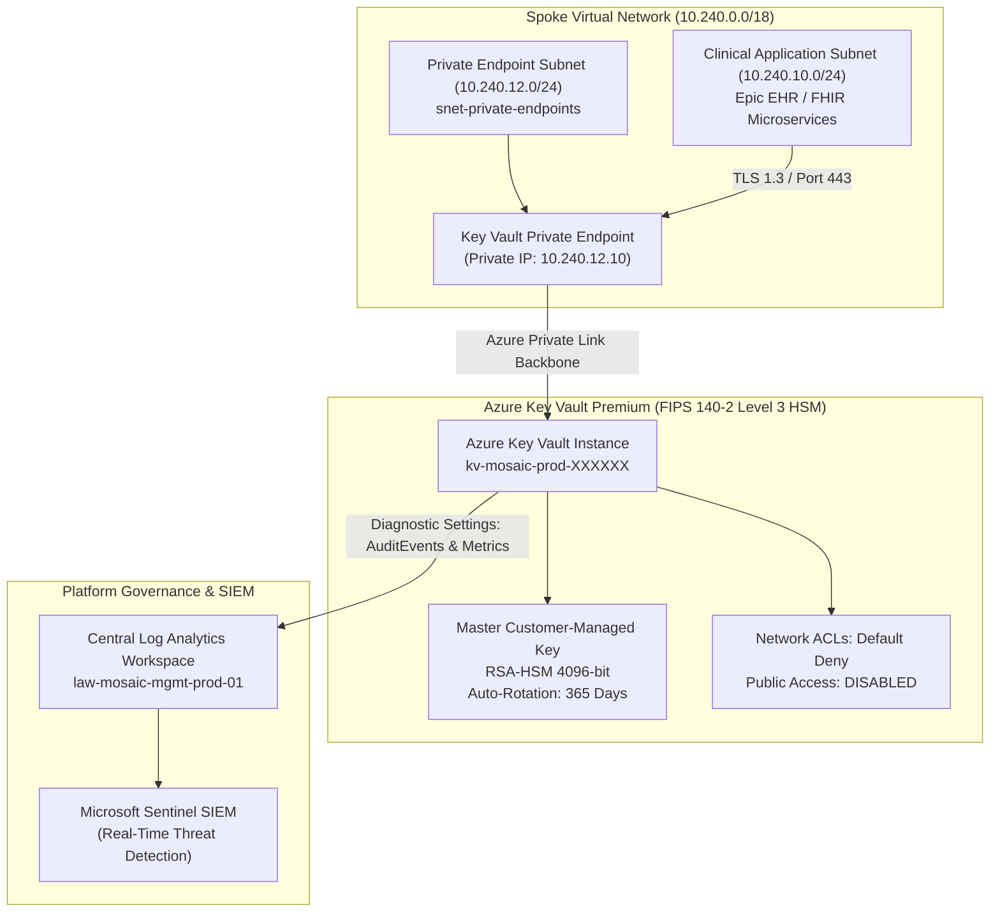

# Gunslinger Secure Vault: Enterprise Azure Key Vault Blueprint

<span class="badge badge-prod">Terraform Module</span>
<span class="badge badge-hitrust">HITRUST Control 02.0</span>
<span class="badge badge-hipaa">FIPS 140-2 Level 3</span>

---

## 1. Module Overview & Cryptographic Architecture

The **`gunslinger-secure-vault`** Terraform module is the definitive reference implementation for provisioning hardened, HITRUST-compliant cryptographic key vaults within the Mosaic Healthcare Azure Landing Zone.

It encapsulates zero-trust network isolation, hardware-backed customer-managed encryption keys (RSA-4096 HSM), automated 365-day rotation policies, purge protection, and immediate SIEM diagnostic log streaming into Microsoft Sentinel.



---

## 2. Source Code Implementation Details

The module consists of clean, declarative Terraform HCL files located in `terraform/gunslinger-secure-vault/`:

- **[`main.tf`](file:///C:/Users/FreeF/projects/mosaic-health-cloud-architecture/terraform/gunslinger-secure-vault/main.tf)** — Resources: `azurerm_key_vault`, `azurerm_key_vault_key`, `azurerm_private_endpoint`, and `azurerm_monitor_diagnostic_setting`.
- **[`variables.tf`](file:///C:/Users/FreeF/projects/mosaic-health-cloud-architecture/terraform/gunslinger-secure-vault/variables.tf)** — Validated parameters with custom regex, SKU enforcement (`premium`), and retention constraints.
- **[`outputs.tf`](file:///C:/Users/FreeF/projects/mosaic-health-cloud-architecture/terraform/gunslinger-secure-vault/outputs.tf)** — Key Vault ID, URI, versioned key ID, versionless key ID, and private endpoint IP.
- **[`terraform.tfvars.example`](file:///C:/Users/FreeF/projects/mosaic-health-cloud-architecture/terraform/gunslinger-secure-vault/terraform.tfvars.example)** — Sanitized enterprise variables template.

---

## 3. Production Usage Example

To instantiate the `gunslinger-secure-vault` module in a clinical workload landing zone:

```hcl
# --------------------------------------------------------------------------------------------------
# Root Infrastructure Deployment: Clinical Landing Zone Key Vault
# --------------------------------------------------------------------------------------------------

module "clinical_key_vault" {
  source = "./terraform/gunslinger-secure-vault"

  vault_prefix                = "kv-mosaic-epic"
  environment                 = "prod"
  location                    = "eastus2"
  resource_group_name         = "rg-mosaic-clinical-prod-01"
  sku_name                    = "premium"
  soft_delete_retention_days  = 90
  purge_protection_enabled    = true
  enabled_for_disk_encryption = true

  private_endpoint_subnet_id = azurerm_subnet.pe_subnet.id
  private_dns_zone_id        = azurerm_private_dns_zone.vault_dns.id
  log_analytics_workspace_id = data.azurerm_log_analytics_workspace.central_law.id

  tags = {
    CostCenter         = "CC-94102-CLINICAL-EHR"
    Owner              = "Clinical-Informatics-Squad"
    Environment        = "Production"
    ComplianceScope    = "HIPAA-HITRUST-CSF-v11"
    DataClassification = "PHI-Restricted"
  }
}

# Example Binding: Encrypting Azure Storage Account with Key Vault CMK
resource "azurerm_storage_account_customer_managed_key" "epic_storage_cmk" {
  storage_account_id = azurerm_storage_account.epic_data.id
  key_vault_id       = module.clinical_key_vault.key_vault_id
  key_name           = "kv-mosaic-epic-master-kek-01"
  user_assigned_identity_id = azurerm_user_assigned_identity.epic_uami.id
}
```

---

## 4. Operational Runbook & Key Rotation Verification

### Verifying Automated Key Rotation via Azure CLI

```bash
# Query active key rotation policy
az keyvault key rotation-policy show \
  --vault-name kv-mosaic-prod-a8f2c1 \
  --name kv-mosaic-master-kek-01 \
  --query "lifetimeActions"
```

### Expected Output:
```json
[
  {
    "action": {
      "type": "Rotate"
    },
    "trigger": {
      "timeAfterCreate": "P365D"
    }
  },
  {
    "action": {
      "type": "Notify"
    },
    "trigger": {
      "timeBeforeExpiry": "P30D"
    }
  }
]
```
